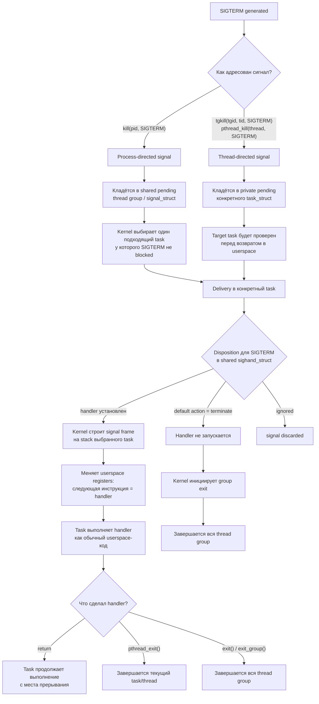

# Linux

## 1. Процесс, поток и `task_struct`

**`task_struct`** → объект ядра для одной планируемой сущности: процесса или потока.

**Процесс** → группа потоков, обычно разделяющих память, FD, cwd/root и обработчики сигналов.

**Поток** → отдельный `task_struct`, который выполняется планировщиком, но может разделять ресурсы с другими потоками процесса.

**TID** → ID конкретного потока.

**TGID** → ID группы потоков, то есть привычный PID процесса.

**Лидер группы потоков / главный поток процесса** → поток, у которого `TID == TGID`.

**Остальные потоки** → `TID != TGID`, но `TGID` общий.

**PID в userspace** → обычно TGID, если говорят о процессе; в ядре PID namespace хранит ID разных типов.

**`getpid()`** → возвращает TGID.

**`gettid()`** → возвращает TID текущего потока.

**`/proc/<PID>/task/`** → список TID всех потоков процесса.

---

## 2. Какие ресурсы может разделять `task_struct`

У каждого потока есть ссылки на отдельные объекты ядра:

**`mm_struct`** → виртуальное адресное пространство процесса.

**`files_struct`** → таблица файловых дескрипторов.

**`fs_struct`** → cwd, root и umask.

**`sighand_struct`** → таблица обработчиков сигналов.

**`signal_struct`** → общее signal-состояние thread group: process-directed pending signals, group stop/exit, timers/accounting.

**credentials** → UID, GID, groups, capabilities.

**namespaces** → какие PID, mounts, network, users и другие объекты видит задача.

Главная модель:

```text
task_struct
├─ mm
├─ files
├─ fs
├─ sighand/signal
├─ credentials
└─ namespaces
```

---

## 3. `clone()`, `fork()`, потоки и уровни клонирования

**`clone()` / `clone3()`** → низкоуровневое создание новой `task_struct` с выбором, какие ресурсы разделять.

Основные флаги:

**`CLONE_VM`** → разделять `mm_struct`, то есть одно адресное пространство.

**`CLONE_FILES`** → разделять одну таблицу FD.

**`CLONE_FS`** → разделять cwd/root/umask.

**`CLONE_SIGHAND`** → разделять обработчики сигналов.

**`CLONE_THREAD`** → поместить задачу в ту же thread group, общий TGID.

**`CLONE_NEWNS`** → создать новый mount namespace.

**`CLONE_NEWPID`** → создать новый PID namespace.

**`CLONE_NEWNET`** → создать новый network namespace.

**`CLONE_NEWUSER`** → создать новый user namespace.

**`CLONE_NEWUTS`** → отдельные hostname/domainname.

**`CLONE_NEWIPC`** → отдельный SysV IPC / POSIX message queue namespace.

Упрощённо:

```text
много CLONE_* для разделения ресурсов
→ поток

почти ничего не разделяем
→ отдельный процесс
```

**`fork()`** → специальный случай создания нового процесса: новый PID/TGID, отдельные kernel-объекты, но память сначала Copy-on-Write.

**`pthread_create()`** → обычно вызывает `clone()` с `CLONE_VM | CLONE_FILES | CLONE_FS | CLONE_SIGHAND | CLONE_THREAD ...`.

---

## 4. Что происходит с памятью при `fork()`

До `fork()`:

```text
parent task_struct
→ parent mm_struct
→ page tables
→ физические страницы
```

После `fork()`:

```text
parent task_struct → parent mm_struct ─┐
                                       ├→ те же физические страницы
child task_struct  → child mm_struct  ─┘
```

Но:

- у родителя и ребёнка **разные `mm_struct`**;
- у них **разные page tables**;
- PTE (Page Table Entry, запись в таблице страниц) на приватные страницы помечаются как read-only/COW;
- физические страницы временно общие;
- при первой записи возникает page fault;
- ядро выделяет новую физическую страницу;
- копирует содержимое;
- меняет PTE (Page Table Entry, запись в таблице страниц) пишущего процесса.

**Copy-on-Write** → копирование происходит не во время `fork()`, а при первой записи в общую приватную страницу.

**Файловые `MAP_SHARED` mappings** → остаются разделяемыми.

**`MAP_PRIVATE` mappings** → используют COW.

---

## 5. `execve()`

**`execve()`** → заменяет программу внутри существующего процесса.

Сохраняется:

- PID/TGID;
- credentials с учётом setuid/setgid/capabilities;
- FD без `FD_CLOEXEC`;
- некоторые свойства процесса.

Заменяется:

- `mm_struct`;
- код;
- heap;
- stack;
- mappings;
- argv/env;
- обработчики пойманных сигналов сбрасываются на default.

Главная формула:

```text
fork() → новый процесс
execve() → новая программа в старом PID
```

---

## 6. Родители, дети, zombie и orphan

**Parent PID** → PID процесса, который создал ребёнка.

**Zombie** → ребёнок завершился, но родитель ещё не забрал exit status через `wait()` / `waitpid()`.

**Zombie хранит** → PID, exit code, usage statistics; память программы уже освобождена.

**Orphan** → живой ребёнок, чей родитель умер.

**Reparenting** → orphan принимает PID 1 или subreaper.

**`waitpid(..., WNOHANG)`** → проверить ребёнка без блокировки.

---

## 7. Сигналы

**Сигнал** → асинхронное уведомление thread group целиком или конкретному потоку.

**Disposition** → default action, ignore или handler.

**Blocked signal** → остаётся pending до разблокировки.

**Process-directed signal** → адресован thread group целиком; handler выполняется в одном подходящем потоке.

**Thread-directed signal** → адресован конкретному TID через `tgkill()`/`pthread_kill()` или hardware exception.

**Terminate/stop/continue disposition** → даже для thread-directed signal действие применяется ко всей thread group.

Основные:

**`SIGTERM`** → просьба корректно завершиться.

**`SIGKILL`** → принудительное завершение; сигнал нельзя поймать, заблокировать или игнорировать, но task может завершиться не мгновенно, например пока находится в uninterruptible sleep (D-state).

**`SIGSTOP`** → остановка; нельзя поймать или игнорировать.

**`SIGCONT`** → продолжить остановленный процесс.

**`SIGCHLD`** → изменилось состояние ребёнка.

**`SIGSEGV`** → неверный виртуальный адрес или запрещённый доступ.

**`SIGBUS`** → адресная операция невозможна из-за backing/alignment/device mapping.

**`SIGINT`** → обычно Ctrl+C.

**`SIGHUP`** → исторически потеря терминала; часто используется как reload.

**Realtime signals** → `SIGRTMIN..SIGRTMAX`, очередятся и могут нести значение.

### Linux signal handling: пример `SIGTERM`

Сигнал в Linux лучше думать не как «мгновенный прыжок в handler», а как событие,
которое сначала становится pending, а потом доставляется конкретному `task_struct`
перед возвратом этого task в userspace.



## Короткая модель

```text
pending signal:
  - group-level: shared pending в signal_struct
  - task-level: private pending в конкретном task_struct

handler/disposition:
  - общий для thread group через sighand_struct

handler execution:
  - всегда в одном конкретном task
  - на stack этого task

default terminate/stop/continue/core:
  - действует на всю thread group
```

## Примеры

```text
kill(pid, SIGTERM), handler есть
→ signal pending на thread group
→ kernel выбирает один task
→ handler выполняется в этом task

kill(pid, SIGTERM), handler нет
→ default terminate
→ завершается вся thread group

pthread_kill(thread, SIGTERM), handler есть
→ signal pending на конкретный task
→ handler выполняется в этом task

pthread_kill(thread, SIGTERM), handler нет
→ default terminate
→ завершается вся thread group
```

Главная формула:

```text
pending бывает group-level или task-level;
handler/disposition общий для thread group;
handler выполняется в одном task;
fatal/job-control default action действует на всю thread group.
```


---

## 8. Состояния задач

**`R`** → running или runnable.

**`S`** → interruptible sleep; ждёт событие, может быть разбужен сигналом.

**`D`** → uninterruptible sleep; ждёт завершения kernel operation, часто I/O.

**`T`** → stopped или traced.

**`Z`** → zombie.

**`I`** → idle kernel thread.

Важно:

```text
R = уже работает на CPU или ждёт CPU
D = ждёт внутри ядра и не реагирует немедленно даже на SIGKILL
```

---

## 9. Блокирующий I/O, wait queue и `epoll`

**Blocking `read()`** → если данных нет, поток засыпает в wait queue.

**Wait queue** → список задач, ожидающих конкретное событие ядра.

**Wakeup** → драйвер или подсистема меняет состояние задачи на runnable.

**`epoll`** → ядровый объект, который отслеживает readiness множества FD.

**`epoll_wait()`** → один поток спит до готовности одного или нескольких FD.

**Readiness** → операция, вероятно, не заблокируется сейчас.

**Сигнал ≠ readiness** → разные механизмы.

Типовые места, где task может ждать:

| Механизм | Что ждёт task | State                 | Критерий wakeup |
|---|---|-----------------------|---|
| Run queue | CPU time | `R`                   | scheduler выбрал task для выполнения |
| Generic wait queue | событие ядра | `S` или `D`           | владелец события вызвал wakeup |
| Socket/file wait queue | данные, место в buffer, readiness | `S`                   | FD стал readable/writable/error-ready |
| `epoll` wait queue | readiness одного из tracked FD | `S`                   | хотя бы один FD стал ready или истёк timeout |
| Futex wait queue | userspace lock/condvar | `S`                   | `futex_wake()`, timeout или signal |
| Timer/hrtimer queue | время | `S`                   | истёк timeout/sleep deadline |
| Completion wait | завершение kernel operation | `S` или `D`           | operation завершилась и сделала `complete()`/wakeup |
| Kernel mutex/rwsem wait list | kernel lock | `S` или `D`           | lock освободился |
| Block/device queue | завершение I/O request | чаще `D` для sync I/O | device/driver завершил request |
| Signal/job-control stop | продолжение после stop/tracing | `T`                   | `SIGCONT`, debugger или ptrace event |
| Zombie list | parent забрал exit status | `Z`                   | parent вызвал `wait()`/`waitpid()` |

Важно: не везде в очереди лежит сама task. Например в block/device queue обычно лежит I/O request, а task отдельно спит на completion/wait queue.

---

## 10. DMA, IRQ и устройство

**DMA** → устройство передаёт данные между собой и RAM без копирования каждого байта CPU.

**IRQ** → уведомление CPU о событии устройства.

**MSI/MSI-X** → PCIe-устройство сигнализирует прерыванием через специальную memory write transaction.

Типичный read с диска:

```text
read()
→ page cache miss
→ block request
→ task D
→ NVMe DMA в RAM
→ completion IRQ
→ driver завершает request
→ task становится R
```

---

## 11. CPU utilization

**CPU utilization** → доля времени за интервал, когда CPU не был idle.

Категории:

**user** → код userspace.

**system** → код ядра.

**iowait** → CPU idle, пока есть ожидающий I/O.

**irq** → hardware interrupts.

**softirq** → отложенная обработка событий ядра.

**steal** → гипервизор забрал виртуальный CPU.

**nice** → user CPU для процессов с изменённым nice.

Цвета CPU-полоски в `htop`:

| Цвет | Что означает |
|---|---|
| Green | `user`: обычный userspace CPU |
| Blue | `nice`: userspace CPU процессов с изменённым nice |
| Red | `system`: kernel CPU |
| Yellow | `irq`: hardware interrupts |
| Magenta/Purple | `softirq`: software interrupts |
| Gray | `iowait`: CPU idle, пока есть ожидающий I/O |
| Cyan | `steal`: CPU time, забранный гипервизором |
| Orange | `guest`: CPU time виртуальных guest-задач |

Цвета могут отличаться из-за темы/настроек `htop`, но смысл сегментов остаётся тем же.

Важно:

- 100% одного процесса в `top` часто означает один логический CPU;
- 100% всей машины означает заняты почти все логические CPU;
- высокий `%sys` → много работы в ядре;
- высокий `%iowait` → подсказка про I/O, но не диагноз;
- низкий общий CPU может скрывать одно забитое ядро.

---

## 12. Load average

**Load average** → количественная характеристика: экспоненциально сглаженное среднее число задач, которые находятся в активном/проблемном ожидании.

Это не процент загрузки CPU и не объём потреблённых ресурсов. Load average отвечает на вопрос:

```text
сколько задач в среднем за период либо выполнялись/хотели CPU, либо висели в D-state
```

Linux считает задачи в состояниях:

```text
TASK_RUNNING + TASK_UNINTERRUPTIBLE
```

В терминах статусов:

- `R` running → task прямо сейчас выполняется на CPU;
- `R` runnable → task готова выполняться и ждёт CPU в run queue;
- `D` uninterruptible sleep → task ждёт kernel operation, часто I/O.

Не учитывает обычные `S` sleepers, `T` stopped/traced и `Z` zombies.

**1 / 5 / 15** → три EWMA: усреднение примерно за 1, 5 и 15 минут.

**Load average не процент** → `4.0` значит не «4%» и не «400% CPU», а примерно 4 задачи в учитываемых состояниях.

**Load average не нормализован по CPU** → `4.0` на 4 CPU и `4.0` на 64 CPU имеют разный практический смысл.

Интерпретация:

```text
высокий load + высокий CPU
→ вероятна CPU saturation

высокий load + низкий CPU
→ искать D-state, storage, NFS, cgroup quota, affinity
```

Примеры:

```text
4 CPU, load 4.0, CPU высокий
→ машина примерно на пределе по CPU

64 CPU, load 4.0
→ обычно небольшой load

CPU низкий, load 20.0
→ вероятно, много задач в D-state или другом ожидании ядра
```

`/proc/loadavg`:

```text
1m 5m 15m running/total latest_pid
```

---

## 13. Виртуальная память

**Virtual address** → адрес, которым пользуется процесс.

**MMU** → переводит virtual address в physical address.

**Page table** → `virtual page → physical page frame + flags`.

**TLB** → кеш переводов виртуальных адресов.

**VMA** → диапазон virtual addresses с общими permissions и backing/mapping properties.

**Page fault** → нужного mapping/page сейчас нет или нарушены права.

**Minor fault** → данные уже в RAM, но mapping надо настроить.

**Major fault** → пришлось читать данные с диска.

---

## 14. Аллокаторы памяти

**`malloc()`** → userspace allocator, не системный вызов.

**`mmap()` / `brk()`** → способы получить виртуальные диапазоны у ядра.

**Buddy allocator** → выдаёт физические страницы ядру.

**SLUB** → выделяет маленькие типизированные kernel objects.

**`kmalloc()`** → маленькие физически непрерывные kernel allocations, обычно через SLUB.

**`vmalloc()`** → виртуально непрерывная, физически разбросанная память ядра.

**First touch** → физическая страница часто выделяется при первом обращении, а не при `malloc()`.

---

## 15. RAM: основные категории

**Anonymous memory** → heap, stack, anonymous mmap, private COW pages.

**File-backed memory** → executable, `.so`, mmap-файлы.

**Kernel memory** → структуры задач, page tables, network buffers, slab и другое.

**Page cache** → содержимое файлов, закешированное в RAM.

**Free** → буквально неиспользуемые страницы.

**Available** → оценка, сколько памяти можно выдать без тяжёлого swap.

Метрики памяти процесса:

**VIRT / VSZ (Virtual Memory Size / Virtual Set Size)** → весь виртуальный адресный диапазон процесса: reserved/lazy mappings, file mappings, mapped shared libs, heap/stack ranges; может сильно превышать RAM и не означает реально занятую физическую память.

**RSS (Resident Set Size)** → сколько физических страниц сейчас отображено в процесс; shared pages считаются целиком каждому процессу.

**PSS (Proportional Set Size)** → accounting-метрика: RSS с «коллективной ответственностью» за shared pages. Private pages считаются целиком, shared pages делятся между процессами, которые их используют; не равно памяти, которая гарантированно освободится при kill.

**USS (Unique Set Size) / Private memory** → память, уникальная для процесса: private pages, которые не разделяются с другими; ближе всего к нижней оценке RAM, которая освободится при kill.

**Shared memory** → resident pages, отображённые более чем в один процесс: `.so`, file-backed mappings, `MAP_SHARED`, tmpfs/shmem, COW pages до первой записи.

**Private Clean** → private file-backed pages без изменений; можно выбросить и перечитать с backing file.

**Private Dirty** → private изменённые pages; обычно anonymous heap/stack/COW, реальная частная нагрузка на RAM/swap.

**Shared Clean** → shared pages без изменений; часто код `.so`/executables и clean page cache.

**Shared Dirty** → shared изменённые pages; например writable `MAP_SHARED`/shmem/tmpfs.

**Anonymous RSS (Anonymous Resident Set Size)** → resident anonymous memory: heap, stack, anonymous mmap, COW private pages.

**Swap** → сколько страниц процесса выгружено в swap.

**SwapPss (Swap Proportional Set Size)** → доля swap с пропорциональным учётом shared swapped pages.

В `smaps`/`smaps_rollup` PSS/USS полезнее RSS для оценки вклада процесса, но для OOM и reclaim важны также `oom_score_adj`, cgroup, dirty/clean, anonymous/file-backed и shared refs.

---

## 16. Page cache

**Page cache** → общий кеш содержимого файлов в RAM.

**Clean page** → совпадает с диском, можно выбросить.

**Dirty page** → изменена, перед reclaim надо записать.

Read:

```text
read()
→ page cache hit → RAM
→ miss → disk → page cache → process
```

Write:

```text
write()
→ page cache page становится dirty
→ writeback позже пишет на диск
```

**Executable и `.so`** → их file-backed страницы тоже проходят через page cache.

**`MAP_SHARED`** → изменения видны другим mapping и уходят в файл.

**`MAP_PRIVATE`** → первая запись создаёт anonymous COW page.

---

## 17. Shared libraries

**`.so`** → ELF shared object.

**Dynamic linker** → мапит зависимости, делает relocations, запускает constructors.

**`DT_NEEDED`** → список runtime-зависимостей ELF.

**Code и read-only data `.so`** → обычно физически разделяются между процессами.

**Writable globals `.so`** → отдельное состояние на процесс через private mappings/COW.

**Static binary** → код библиотек уже внутри executable; обычные `.so` могут не требоваться.

---

## 18. Swap

**Swap** → disk-backed место для вытесненных anonymous/private pages.

В swap не надо отправлять чистый page cache: его можно просто выбросить и перечитать из файла.

**Swap-out** → RAM page записана в swap.

**Swap-in** → page fault возвращает страницу в RAM.

**`swappiness`** → насколько охотно ядро выгружает приватную память процессов в swap вместо того, чтобы освобождать файловый кеш; это не процент заполнения RAM.

Плохо не само `SwapUsed`, а:

- постоянные `si/so`;
- major faults;
- disk latency;
- thrashing.

**Swap** → аварийный запас времени, а не замена RAM.

---

## 19. OOM killer

**OOM** → ядро не смогло удовлетворить allocation после reclaim/writeback/swap.

**Global OOM** → закончилась память хоста.

**Cgroup OOM** → процесс вышел за memory limit своего cgroup.

**`oom_score`** → текущая привлекательность процесса как жертвы.

**`oom_score_adj`** → ручная поправка от `-1000` до `1000`.

**`-1000`** → не выбирать обычным OOM killer; не гарантирует работоспособность системы.

OOM killer не знает бизнес-ценность процесса. Он выбирает жертву, освобождение которой поможет системе выжить.

Надёжность задаётся заранее:

- cgroups;
- `MemoryMax`;
- отдельные сервисы/узлы;
- разумный `oom_score_adj`;
- memory limits.

---

## 20. Файловая система

**Filesystem** → структура, которая превращает блоки устройства в файлы, каталоги и metadata.

Основные объекты:

**superblock** → metadata всей filesystem.

**inode** → metadata одного файлового объекта.

**directory entry** → запись `имя → inode number`.

**data blocks / extents** → содержимое обычного файла.

Главная цепочка:

```text
path
→ directory entries
→ inode
→ data blocks / callbacks / driver
```

---

## 21. Inode

**Inode** → безымянный объект filesystem: обычный файл, каталог, symlink, socket, FIFO или device node.

Обычно хранит:

- тип;
- permissions;
- UID/GID;
- size;
- timestamps;
- link count;
- block/extents references;
- filesystem-specific metadata.

Не хранит имя файла.

Один inode может иметь несколько имён через hard links.

**Link count** → число directory entries, указывающих на inode.

Файл окончательно освобождается, когда:

```text
link count == 0
и
нет открытых ссылок ядра
```

---

## 22. Directory и directory entry

**Directory** → inode специального типа: filesystem хранит в нём directory entries:

```text
name → inode number
```

Userspace читает directory entries через `readdir()`/`getdents64()`, а не обычным `read()`.

Сырой формат directory data — деталь конкретной filesystem; VFS отдаёт стабильную абстракцию записей каталога.

Каталог не хранит полный путь. Он хранит только имена непосредственных детей.

Полный путь:

```text
/etc/nginx/nginx.conf
```

разбирается как:

```text
/
→ etc
→ nginx
→ nginx.conf
```

---

## 23. Dentry

**`struct dentry`** → VFS-объект для результата lookup компонента пути: связка `parent directory + name → inode` или negative result.

Содержит логически:

```text
name
parent dentry
inode pointer
flags
reference counters
cache state
```

**Dentry cache / dcache** → кеш уже разобранных компонентов путей.

**Negative dentry** → кешированное знание, что такого имени в каталоге нет.

Разница:

```text
directory entry → запись filesystem
dentry          → объект VFS в RAM
```

---

## 24. Hard link

**Hard link** → ещё одна directory entry на тот же inode.

```bash
ln file.txt another.txt
```

```text
file.txt    ─┐
             ├→ один inode
another.txt ─┘
```

Нет оригинала и копии. Оба имени равноправны.

Ограничения:

- обычно только внутри одной filesystem;
- hard links на директории пользователю запрещены;
- удаление одного имени не удаляет inode, пока есть другие ссылки.

---

## 25. Symbolic link

**Symlink** → отдельный inode типа symlink, содержащий строку пути.

```bash
ln -s /opt/app/config.yaml current
```

```text
current inode
→ data: "/opt/app/config.yaml"
```

Если цель удалили, symlink становится broken.

Symlink:

- может пересекать filesystem;
- может ссылаться на каталог;
- может быть относительным или абсолютным;
- относительный путь считается от каталога самого symlink.

---

## 26. Mount

**Mount** → прикрепить корень одной filesystem к каталогу в существующем дереве.

```text
source filesystem
→ mount point
→ единое дерево /
```

**Mount point** → каталог, где происходит переключение на другую filesystem.

Файлы, уже лежавшие в mount point, не удаляются — они скрыты до `umount`.

**`/etc/fstab`** → постоянные mounts при загрузке.

**UUID** → стабильнее, чем `/dev/sdb1`.

Полезно:

```bash
findmnt
findmnt -T /path
lsblk -f
blkid
```

---

## 27. Bind mount

**Bind mount** → показать существующий каталог ещё в одном месте дерева.

```bash
mount --bind /srv/data /var/lib/app
```

Это не symlink: VFS видит настоящий mount.

Используется в:

- контейнерах;
- chroot;
- изоляции;
- подстановке каталогов.

---

## 28. FD, `struct file`, dentry и inode

**FD (File Descriptor)** → неотрицательный `int`-handle в userspace, индекс в per-process FD table; не pointer и не `int64` на 64-bit системах.

Обычно:

```text
0 stdin
1 stdout
2 stderr
3+ остальные объекты
```

Полная цепочка:

```text
fd
→ files_struct
→ struct file
→ struct path
   ├─ mount
   └─ dentry
→ inode
→ data / filesystem callbacks / driver
```

**`struct file`** → конкретное открытие объекта.

Хранит:

- current offset;
- open flags;
- access mode;
- file operations;
- path;
- reference count.

**Inode** → сам объект.

**Dentry** → его имя в конкретном каталоге.

Максимальный FD ограничен `RLIMIT_NOFILE` (`ulimit -n`) и kernel limits, а не размером машинного слова.

---

## 29. `open()`, `dup()` и `fork()` для FD

Два `open()` одного файла:

```text
fd 3 → struct file A, offset A ─┐
                                ├→ один inode
fd 4 → struct file B, offset B ─┘
```

`dup()`:

```text
fd 3 ─┐
      ├→ один struct file → общий offset
fd 4 ─┘
```

`fork()`:

```text
parent fd 3 ─┐
             ├→ один struct file
child fd 3  ─┘
```

`execve()` → FD сохраняются, кроме `FD_CLOEXEC`.

---

## 30. Deleted-but-open file

`rm` удаляет directory entry, а не обязательно inode.

Если файл открыт:

```text
rm path
→ имя исчезло
→ open struct file держит inode
→ процесс продолжает читать/писать
```

Доступ:

```text
/proc/<PID>/fd/<FD>
```

Поиск:

```bash
lsof +L1
lsof | grep deleted
```

Восстановление копией:

```bash
cp /proc/<PID>/fd/<FD> recovered.log
```

После закрытия последнего FD при link count `0` inode и blocks освобождаются.

Классический симптом:

```text
df → диск занят
du → больших файлов нет
```

---

## 31. VFS

**VFS** → единый интерфейс ядра ко всем filesystem и файловым объектам.

Общий путь:

```text
pathname
→ dentry
→ inode
→ operations
```

Основные таблицы поведения:

**`inode_operations`** → lookup, create, mkdir, unlink, rename, symlink.

**`file_operations`** → read, write, mmap, poll, ioctl, release.

Это полиморфизм на C:

```text
VFS вызывает read
→ конкретная filesystem / driver подставляет свою реализацию
```

---

## 32. `/proc`

**procfs** → виртуальная filesystem, которая показывает состояние процессов и ядра.

```text
/proc/<PID>/status
/proc/<PID>/maps
/proc/<PID>/fd
/proc/<PID>/fdinfo
/proc/<PID>/environ
/proc/<PID>/limits
/proc/<PID>/ns
/proc/<PID>/mountinfo
```

Общесистемное:

```text
/proc/meminfo
/proc/stat
/proc/loadavg
/proc/uptime
/proc/mounts
```

Inode procfs не указывает на disk blocks. Его `read()` вызывает callback, который генерирует данные из структур ядра.

---

## 33. `/sys`

**sysfs** → структурированное представление kernel objects, devices, buses и drivers.

Примеры:

```text
/sys/class/net/
/sys/block/
/sys/devices/
```

Файл sysfs обычно представляет один атрибут.

```text
read()
→ callback show()
write()
→ callback store()
```

Запись в sysfs часто означает изменение настройки ядра или драйвера.

---

## 34. `/dev`

**devtmpfs** → filesystem с device nodes.

**Device node** → inode типа character или block device.

Хранит:

```text
major:minor
```

**major** → какой драйвер.

**minor** → какой экземпляр устройства.

Примеры:

```text
/dev/null       char device
/dev/tty        char device
/dev/nvme0n1    block device
```

Цепочка:

```text
open("/dev/null")
→ inode device node
→ major/minor
→ driver file_operations
```

---

## 35. «В Linux всё файл»

Точнее:

> Не всё является файлом, но многое представлено через VFS-интерфейс и FD.

Не файловые kernel objects:

- `task_struct`;
- sockets;
- pipes;
- eventfd;
- epoll;
- timerfd;
- signalfd.

Но процесс часто получает к ним FD и работает через:

```text
read
write
poll
ioctl
close
```

---

## 36. `eventfd`

**`eventfd()`** → создаёт anonymous kernel object с 64-битным счётчиком.

`write()` → увеличивает счётчик.

`read()` → читает и обнуляет счётчик или уменьшает на 1 с `EFD_SEMAPHORE`.

Новый вызов `eventfd()` создаёт новый объект.

Один eventfd между процессами получают через:

- наследование после `fork()`;
- передачу FD через Unix socket `SCM_RIGHTS`.

`/proc/<PID>/fdinfo/<FD>` → показывает type-specific состояние eventfd.

---

## 37. Socket и порт

**Socket object** → kernel object сетевого endpoint.

**Port** → часть сетевого адреса `IP:port`.

**Listening socket** → принимает новые соединения.

**Accepted socket** → отдельный FD для одного соединения.

```text
fd 3 → listening :5432
fd 4 → client A
fd 5 → client B
```

---

## 38. Unix domain socket

**Unix socket** → IPC-сокет между процессами на одной машине.

Pathname socket:

```text
/run/app.sock
```

После `bind()` появляется inode типа socket.

Файл сокета:

- не хранит сообщения;
- служит именем точки подключения;
- права на path участвуют в доступе;
- можно удалить, и существующие соединения продолжат работать;
- новые подключения по удалённому пути не пройдут.

**Abstract Unix socket** → имя живёт только в ядре, в filesystem записи нет; в `ss` часто показывается с `@`.

**`SCM_RIGHTS`** → передача FD через Unix socket.

---

## 39. FUSE

**FUSE** → filesystem callbacks реализуются userspace-процессом.

```text
open/read/write
→ VFS
→ FUSE kernel module
→ userspace filesystem daemon
```

Можно создать виртуальные файлы, чьё содержимое:

- генерируется;
- приходит из API;
- строится из базы;
- вообще не хранится на диске.

FUSE действует только внутри своего mount point.

---

## 40. Файловые трюки

**Atomic rename** → внутри одной filesystem `rename()` обычно переключает имя атомарно.

Надёжная запись:

```text
write temp
→ fsync(temp)
→ rename(temp, final)
→ fsync(parent directory)
```

**Cross-filesystem `mv`** → copy + delete, не atomic rename.

**Sparse file** → логический размер больше реально занятых blocks.

**Reflink** → два inode сначала разделяют data extents через COW.

Часто поддерживается:

- Btrfs;
- XFS с reflink.

Обычно не поддерживается обычным ext4.

---

## 41. Основные filesystem

**ext4** → зрелый универсальный default для обычного Linux-сервера.

**XFS** → большие volumes, масштабный параллельный I/O; shrink обычно недоступен.

**Btrfs** → COW, snapshots, subvolumes, compression, checksums, reflink, send/receive.

**ZFS** → filesystem + volume manager + pools + checksums + RAIDZ + snapshots + replication.

**tmpfs** → данные в RAM/swap, исчезают после reboot.

**NFS** → общий каталог по сети.

**CephFS** → распределённая filesystem поверх Ceph.

**exFAT** → переносные носители между ОС, не серверная Unix filesystem.

---

## 42. systemd

**systemd** → PID 1 и менеджер units/services хоста.

`[Service]`:

```ini
User=myapp
ExecStart=/usr/local/bin/myapp
Restart=on-failure
```

Типы:

**`Type=simple`** → systemd считает service started сразу после запуска процесса; готовности приложения не ждёт.

**`Type=exec`** → systemd считает запуск успешным после успешного `execve()`.

**`Type=notify`** → приложение явно сообщает `READY=1`.

**`Type=oneshot`** → короткая команда должна завершиться.

**`Type=forking`** → старый daemon fork-модели.

Зависимости:

**`Wants=`** → мягко добавить unit в transaction.

**`Requires=`** → сильная requirement dependency: dependency включается в transaction, и её failure/deactivation может повлиять на requiring unit.

Порядок:

**`After=` / `Before=`** → только ordering.

Важно:

```text
Requires != After
After не запускает unit
```

Команды:

```bash
systemctl start
systemctl stop
systemctl restart
systemctl enable
systemctl disable
systemctl mask
systemctl daemon-reload
systemctl status
systemctl cat
systemctl show
```

---

## 43. D-Bus

**D-Bus** → userspace message bus для IPC между процессами.

Обычно есть два bus:

**System bus** → системные сервисы: systemd, NetworkManager, login/session management.

**Session bus** → процессы внутри пользовательской сессии.

Транспорт обычно Unix socket.

Модель:

```text
client
→ bus daemon / broker
→ service
```

Основные сущности:

**Bus name** → имя сервиса на bus, например `org.freedesktop.systemd1`.

**Object path** → путь объекта внутри сервиса, например `/org/freedesktop/systemd1`.

**Interface** → набор methods/properties/signals.

**Method call** → запрос к сервису.

**Signal** → broadcast/event от сервиса подписчикам.

`systemctl` общается с systemd в основном через D-Bus API.

---

## 44. journald

**journald** → сборщик structured logs systemd.

Источники:

- stdout/stderr service;
- kernel;
- systemd;
- syslog API;
- metadata процесса.

Полезно:

```bash
journalctl -u myapp
journalctl -u myapp -f
journalctl -u myapp -b
journalctl -b -1
journalctl --since "30 minutes ago"
journalctl -p err
journalctl -r -n 20
journalctl -k
```

---

## 45. `dmesg`

**`dmesg`** → просмотр kernel ring buffer: сообщений, которые пишет ядро.

Типичные события:

- boot logs;
- driver/device messages;
- OOM killer;
- filesystem/kernel warnings;
- USB/PCI/network/storage events;
- kernel oops/panic traces.

Полезно:

```bash
dmesg -T
dmesg -w
dmesg | grep -i oom
journalctl -k
```

Разница:

```text
dmesg
→ читает kernel ring buffer
→ только kernel messages
→ buffer ограничен и старые записи вытесняются

journald / journalctl
→ системный лог-агрегатор systemd
→ собирает kernel logs, stdout/stderr сервисов, syslog и metadata
→ может хранить историю по boot-ам
```

**`journalctl -k`** → kernel logs, сохранённые journald; пересекается с `dmesg`, но идёт через journal.

---

## 46. Environment variables

**Environment** → массив строк `KEY=VALUE`, переданный в `execve()`.

Shell:

```bash
FOO=bar
export FOO=bar
FOO=bar command
```

Ребёнок получает копию environment.

Изменение environment ребёнка не меняет environment родителя.

Запущенный процесс сам не увидит изменение конфигурационного env-файла: нужен restart или собственный reload.

systemd:

```ini
Environment=FOO=bar
EnvironmentFile=/etc/myapp/env
```

---

## 47. Secrets

Secret в env после старта становится обычной частью environment процесса.

Риски:

- наследование детьми;
- `/proc`;
- debug dumps;
- crash reports;
- logs;
- tooling.

Предпочтительно:

- root-owned file;
- systemd credentials;
- Vault/KMS/secret manager;
- mounted Kubernetes Secret;
- workload identity.

Задача не сделать secret магически невидимым приложению, а уменьшить доступ, lifetime и blast radius.

---

## 48. UID, GID и permissions

**UID** → пользователь.

**GID** → основная группа.

**Supplementary groups** → дополнительные группы.

Проверка обычных mode bits:

```text
если EUID == owner
→ owner bits

иначе если группа совпала
→ group bits

иначе
→ others bits
```

Категории не складываются.

Права записываются тремя группами:

```text
owner group others
  r w x  r w x  r w x
```

Числовая форма:

```text
r = 4
w = 2
x = 1

--- = 0
--x = 1
-w- = 2
-wx = 3
r-- = 4
r-x = 5
rw- = 6
rwx = 7
```

Примеры:

```text
755 = owner rwx, group r-x, others r-x
644 = owner rw-, group r--, others r--
600 = owner rw-, group ---, others ---
070 = owner ---, group rwx, others ---
```

Если owner bits дают меньше прав, чем group bits, owner всё равно получит owner bits: проверка останавливается на первом совпавшем классе.

Для файла:

```text
r read
w modify
x execute
```

Для каталога:

```text
r list names
w create/delete/rename entries
x traverse
```

Удаление файла определяется в первую очередь правами родительского каталога.

---

## 49. setuid, setgid, sticky

**setuid executable** → effective UID становится UID владельца файла при `execve()`.

**setgid executable** → effective GID становится GID файла.

**setgid directory** → новые объекты наследуют группу каталога.

**sticky directory** → в общей writable-директории нельзя удалять чужие файлы.

```bash
chmod 4755 file
chmod 2755 dir
chmod 1777 dir
```

Как это выглядит в `ls -l`:

```text
-rwsr-xr-x  root root  /usr/bin/passwd
```

`s` на месте owner execute означает `setuid` + executable.

```text
-rwxr-sr-x  root staff  ./tool
```

`s` на месте group execute означает `setgid` + executable.

```text
drwxrwsr-x  root dev  ./shared-project
```

`s` на месте group execute у каталога означает `setgid directory`: новые файлы наследуют группу каталога.

```text
drwxrwxrwt  root root  /tmp
```

`t` на месте others execute означает sticky directory.

Если execute-бит не выставлен, буква становится заглавной:

```text
-rwSr--r--  setuid есть, owner execute нет
-rw-r-Sr--  setgid есть, group execute нет
drwxrwxrwT  sticky есть, others execute нет
```

---

## 50. Capabilities

**Capabilities** → дробление root-привилегий.

Примеры:

```text
CAP_NET_BIND_SERVICE
CAP_CHOWN
CAP_KILL
CAP_SYS_ADMIN
```

```bash
setcap 'cap_net_bind_service=+ep' ./server
```

systemd:

```ini
AmbientCapabilities=CAP_NET_BIND_SERVICE
CapabilityBoundingSet=CAP_NET_BIND_SERVICE
```

---

## 51. Диагностические цепочки

Сервис не стартует:

```text
systemctl status
→ journalctl -u
→ systemctl cat/show
→ User/permissions/env
→ binary/dependencies
→ port conflict
```

Процесс занял порт:

```bash
ss -ltnp
lsof -i :PORT
```

Открытые файлы процесса:

```bash
ls -l /proc/<PID>/fd
lsof -p <PID>
```

Deleted-open:

```bash
lsof +L1
```

Какая filesystem обслуживает путь:

```bash
findmnt -T /path
```

Memory pressure:

```bash
free -h
vmstat 1
cat /proc/meminfo
```

OOM:

```bash
journalctl -k
dmesg
cat /proc/<PID>/oom_score
cat /proc/<PID>/oom_score_adj
```

D-state:

```bash
ps -eo pid,stat,wchan:32,comm
cat /proc/<PID>/stack
journalctl -k
```

# Network

## 1. OSI, инкапсуляция и уровни

**L1 / Physical** → сигнал и физическая среда: электричество/оптика/радио, bit rate/baud, шум, затухание.

**L2 / Data Link** → локальная Ethernet-доставка: MAC, frame, switch.

**L3 / Network** → доставка между IP-сетями: IP, routing, router, next hop.

**L4 / Transport** → связь между процессами: TCP/UDP, ports.

**L7 / Application** → HTTP, DNS, TLS и другие прикладные протоколы.

**Инкапсуляция**:

```text
HTTP
↓
TLS
↓
TCP
↓
IP
↓
Ethernet
```

**Frame** → L2.  
**Packet** → IP/L3.  
**Segment** → TCP/L4.

---

## 2. Ethernet, MAC и switch

**MAC address** → L2-адрес интерфейса.

**NIC** → Network Interface Card, сетевой интерфейс.

**Switch** → пересылает Ethernet frames внутри L2-сегмента.

**MAC table / CAM table** → `MAC → switch port`.

**MAC learning** → switch запоминает `src MAC → ingress port` из входящих frames.

**Flooding** → `dst MAC` в Ethernet frame есть всегда; если switch не знает port для этого MAC в MAC table, frame рассылается по подходящим портам VLAN, кроме входного.

**Broadcast MAC** → `ff:ff:ff:ff:ff:ff`.

**Ethernet II** → dst MAC, src MAC, EtherType, payload, FCS.

**EtherType** → что лежит внутри Ethernet payload.

Примеры:

```text
0x0800 → IPv4
0x86DD → IPv6
0x0806 → ARP
```

**FCS / CRC** → обнаружение ошибок кадра; не криптографическая защита.

**MTU** → максимальный IP-пакет, передаваемый через L2 без фрагментации; типично Ethernet MTU = 1500.

---

## 3. IPv4, subnet, mask, prefix

**IPv4 address** → 32-битный L3-адрес интерфейса.

Пример: `192.168.1.10`.

**Subnet** → диапазон IP с общим сетевым префиксом.

Пример: `192.168.1.0/24` содержит адреса `192.168.1.0`–`192.168.1.255`.

**Prefix `/24`** → первые 24 бита сеть, остальные host part.

Пример: в `192.168.1.10/24` сеть — `192.168.1`, host part — `10`.

**Subnet mask** → другая запись prefix: `/24 = 255.255.255.0`.

Пример: `192.168.1.10/255.255.255.0` то же самое, что `192.168.1.10/24`.

**Network address** → адрес подсети.

Пример: для `192.168.1.10/24` network address — `192.168.1.0`.

**Broadcast address** → широковещательный адрес подсети.

Пример: для `192.168.1.10/24` broadcast address — `192.168.1.255`.

**`/32`** → один IPv4.

Пример: `192.168.1.10/32` означает только адрес `192.168.1.10`.

**`/31`** → часто point-to-point link.

Пример: `10.0.0.0/31` даёт два адреса для двух концов link: `10.0.0.0` и `10.0.0.1`.

Сколько адресов можно назначать хостам:

```text
всего адресов в subnet = 2^(32 - prefix)
обычно usable = всего - 2
```

Два адреса обычно не назначают хостам:

- network address;
- broadcast address.

Пример:

```text
192.168.1.0/24
→ всего 256 адресов
→ usable 254 адреса: 192.168.1.1–192.168.1.254
→ 192.168.1.0   = network address
→ 192.168.1.255 = broadcast address
```

Исключения:

```text
/31 → 2 usable адреса для point-to-point link
/32 → 1 адрес, один host route
```

---

## 4. Gateway и routing

**Routing table** → правила:

```text
destination prefix → next hop / interface
```

Пример:

```text
192.168.1.0/24 → directly connected, eth0
10.0.0.0/8     → via 192.168.1.1, eth0
0.0.0.0/0      → via 192.168.1.1, eth0
```

**Longest Prefix Match** → выбирается самый специфичный маршрут.

Пример:

```text
routing table:
10.0.0.0/8      → via 192.168.1.1
10.20.0.0/16    → via 192.168.1.2
10.20.30.0/24   → via 192.168.1.3
0.0.0.0/0       → via 192.168.1.254

destination: 10.20.30.40
```

Подходят маршруты:

```text
10.0.0.0/8
10.20.0.0/16
10.20.30.0/24
0.0.0.0/0
```

Выбран будет:

```text
10.20.30.0/24 → via 192.168.1.3
```

Потому что `/24` специфичнее, чем `/16`, `/8` и `/0`.

**Default route** → `0.0.0.0/0`.

Пример:

```text
0.0.0.0/0 → via 192.168.1.1, eth0
```

**Default gateway** → next hop для default route.

Пример: `192.168.1.1`.

**Gateway не вычисляется из IP/маски** → он приходит из конфигурации, например DHCP.

Пример: для `192.168.1.10/24` gateway не обязан быть `192.168.1.1`; это просто частый convention.

**Next hop** → следующий L3-узел, которому передаётся packet.

Пример: при маршруте `10.0.0.0/8 → via 192.168.1.1` next hop — `192.168.1.1`.

---

## 5. ARP / neighbour table

**ARP** → Address Resolution Protocol; сопоставляет локальный next-hop IPv4 с MAC.

```text
нужен gateway 192.168.1.1
↓
ARP: "у кого 192.168.1.1?"
↓
получили MAC gateway
↓
Ethernet dst = MAC gateway
```

**ARP работает внутри локального L2-сегмента.**

**Neighbour table** → кэш `IP → MAC` + состояние соседа.

Если destination в другой subnet, ARP ищет MAC **router/next hop**, а не далёкого сервера.

---

## 6. IPv4 header, fragmentation и PMTUD

**TTL** → уменьшается на каждом hop; при 0 packet уничтожается.

**Fragmentation** → IPv4 может разбить большой packet на fragments.

**DF / Don't Fragment** → запрет fragmentation.

**PMTUD** → Path MTU Discovery, поиск максимального packet size на пути без fragmentation.

**ICMP** → сообщения об ошибках/служебная диагностика, в том числе участвует в PMTUD.

---

## 7. Port, socket, bind и FD

**Port** → L4-номер точки подключения процесса.

**Socket** → kernel object для network endpoint/connection.

**FD / File Descriptor** → integer handle процесса на kernel object, включая socket.

**`bind()`** → привязать socket к локальному `IP:port`.

**`listen()`** → начать ожидать входящие TCP connections.

**`accept()`** → получить отдельный connected socket/FD.

**TCP 4-tuple**:

```text
src IP
src port
dst IP
dst port
```

**5-tuple** → то же + protocol.

**Ephemeral port** → временный client source port, обычно выбранный ОС.

---

## 8. TCP: базовая модель

**TCP** → надёжный двунаправленный byte stream.

**Handshake**:

```text
SYN
SYN-ACK
ACK
```

Алгоритм:

1. TCP connection — full-duplex: есть отдельный byte stream `client → server` и отдельный byte stream `server → client`.

2. У каждого направления свой sequence space:

```text
client_isn = 1000
server_isn = 5000
```

3. Client отправляет первый segment:

```text
client → server
SYN
SEQ = client_isn = 1000
```

Это задаёт initial sequence number для направления `client → server`.

4. Server отвечает:

```text
server → client
SYN + ACK
SEQ = server_isn = 5000
ACK = client_isn + 1 = 1001
```

`SEQ = 5000` задаёт initial sequence number для направления `server → client`.

`ACK = 1001` подтверждает клиентский `SYN`.

5. Client подтверждает серверный `SYN`:

```text
client → server
ACK
SEQ = client_isn + 1 = 1001
ACK = server_isn + 1 = 5001
```

6. После handshake:

```text
client next SEQ = 1001
server next SEQ = 5001
```

`SYN` занимает один sequence number, хотя не несёт data byte.

Важно:

```text
SEQ относится к своему направлению передачи.
ACK относится к обратному направлению: какой следующий byte ожидаем от peer.
```

**SEQ** → номер байта в stream.

**ACK** → номер следующего ожидаемого байта.

**Retransmission** → повторная отправка потерянных данных.

**RTT** → Round Trip Time.

**RTO** → Retransmission Timeout.

**Fast Retransmit** → ранняя повторная отправка при признаках потери.

**SACK** → Selective Acknowledgement.

**MSS** → Maximum Segment Size, TCP payload без IP/TCP headers.

---

## 9. TCP windows: `rwnd` и `cwnd`

**TCP window** → ограничение на количество данных, которые можно отправить без получения новых ACK.

В TCP есть два разных ограничения:

**`rwnd` / receive window** → окно получателя; сколько данных peer готов принять в свой receive buffer.

**`cwnd` / congestion window** → окно congestion control; сколько данных sender считает безопасным держать “в полёте” в сети.

Реально отправитель ограничен меньшим из двух:

```text
send window = min(rwnd, cwnd)
```

Пример:

```text
rwnd = 64 KB
cwnd = 16 KB
→ sender может держать in-flight только 16 KB
```

Другой пример:

```text
rwnd = 8 KB
cwnd = 64 KB
→ sender может держать in-flight только 8 KB
```

`rwnd` защищает получателя:

```text
receiver buffer почти заполнен
→ receiver уменьшает advertised window
→ sender замедляется
```

`cwnd` защищает сеть:

```text
loss / timeout / congestion signal
→ congestion control уменьшает cwnd
→ sender отправляет меньше in-flight data
```

**In-flight data** → отправленные bytes, которые ещё не подтверждены ACK.

**Bandwidth-delay product / BDP** → сколько данных нужно держать in-flight, чтобы заполнить канал:

```text
BDP = bandwidth × RTT
```

---

## 10. TCP states и `ss`

**TCP state** → состояние конкретного TCP socket/connection в state machine ядра.

`ss` показывает эти состояния:

```bash
ss -tna
ss -tna state established
ss -tna state listen
ss -tna state time-wait
```

Основные states:

**LISTEN** → server socket ждёт входящие connections.

**SYN-SENT** → client отправил `SYN`, ждёт `SYN-ACK`.

**SYN-RECV** → server получил `SYN`, отправил `SYN-ACK`, ждёт финальный `ACK`.

**ESTAB / ESTABLISHED** → handshake завершён, данные можно передавать в обе стороны.

**FIN-WAIT-1** → сторона отправила `FIN`, ждёт `ACK` или встречный `FIN`.

**FIN-WAIT-2** → `FIN` подтверждён, сторона ждёт `FIN` от peer.

**CLOSE-WAIT** → peer прислал `FIN`; локальное приложение ещё не закрыло socket.

**LAST-ACK** → локальная сторона отправила `FIN` после `CLOSE-WAIT`, ждёт финальный `ACK`.

**TIME-WAIT** → активно закрывшая сторона ждёт, чтобы старые segments не попали в новую connection.

**CLOSING** → обе стороны почти одновременно отправили `FIN`, ждут подтверждения.

Примеры:

```text
LISTEN    0  4096  0.0.0.0:80        0.0.0.0:*
ESTAB     0  0     10.0.0.2:443      10.0.0.5:53044
TIME-WAIT 0  0     10.0.0.2:443      10.0.0.5:53044
```

Частые симптомы:

```text
много SYN-RECV    → backlog/SYN flood/peer не завершает handshake
много CLOSE-WAIT  → приложение не закрывает socket после FIN от peer
много TIME-WAIT   → много коротких connections; обычно нормально для active close
```

---

## 11. TCP close: FIN, RST, TIME_WAIT

**FIN** → нормальное закрытие одного направления.

**TCP full duplex** → направления закрываются независимо.

**RST** → немедленный аварийный reset.

**TIME_WAIT** → состояние активно закрывшей стороны; защищает от старых segments и позволяет повторить финальный ACK.

---

## 12. UDP

**UDP** → datagram protocol без handshake, гарантии доставки, порядка и retransmission.

**Datagram** → отдельное сообщение; границы сообщений сохраняются.

**UDP `connect()`** → handshake не создаёт; фиксирует peer в socket state и упрощает API/фильтрацию.

---

## 13. DNS

**DNS** → Domain Name System.

**A** → IPv4.

**AAAA** → IPv6.

**CNAME** → alias на другое DNS name.

**Resolver** → компонент, который выполняет DNS resolution.

DNS сообщает адрес; дальше работают routing, ARP, TCP/UDP и т.д.

---

## 14. DHCP

**DHCP** → Dynamic Host Configuration Protocol.

**DORA**:

```text
Discover
Offer
Request
ACK
```

DHCP Discover у клиента без IP:

```text
Ethernet dst = ff:ff:ff:ff:ff:ff
IP src = 0.0.0.0
IP dst = 255.255.255.255
UDP src = 68
UDP dst = 67
```

Что происходит, когда новый host приходит в сеть:

1. Client ещё не знает свой IP и DHCP server.

2. Client отправляет broadcast `DHCP Discover`:

```text
Ethernet dst = ff:ff:ff:ff:ff:ff
IP src = 0.0.0.0
IP dst = 255.255.255.255
UDP 68 → 67
xid = client-generated transaction id
```

Этот frame получают все хосты в текущем broadcast domain/VLAN, но отвечает только DHCP server.

3. DHCP server отвечает `DHCP Offer`:

```text
xid = тот же transaction id
server предлагает IP
передаёт lease time и options
например: mask, gateway, DNS
```

Если пришло несколько `Offer`, client обычно выбирает первый подходящий.

4. Client отправляет `DHCP Request`:

```text
xid = тот же transaction id
server identifier = выбранный DHCP server
requested IP = выбранный address
просит выдать предложенный IP
```

Обычно это тоже broadcast, чтобы другие DHCP servers увидели `Server Identifier` и поняли, чей offer выбран.

5. DHCP server отправляет `DHCP ACK`:

```text
xid = тот же transaction id
IP выдан
lease активен
client применяет address/mask/gateway/DNS
```

**Lease** → аренда адреса.

**Static lease / reservation** → конкретному MAC DHCP всегда выдаёт конкретный IP.

---

## 15. DHCP options

DHCP может передать:

**Subnet Mask** → mask/prefix.

**Router** → default gateway.

**DNS Servers** → resolver addresses.

**Lease Time** → время аренды.

**T1/T2** → моменты renewal/rebinding.

**Domain Name / search suffix** → DNS suffix.

**Interface MTU** → MTU.

**NTP Servers** → Network Time Protocol servers.

DHCP только сообщает параметры; ОС сама настраивает interface, routes и resolver.

---

## 16. VLAN

**VLAN** → Virtual Local Area Network, логическое разделение L2-инфраструктуры на отдельные broadcast domains.

**Broadcast одного VLAN не разливается в другой VLAN.**

**VLAN ≠ subnet.**

VLAN → L2.  
Subnet → L3.

На практике часто:

```text
VLAN 10 ↔ 10.10.10.0/24
VLAN 20 ↔ 10.10.20.0/24
```

Между VLAN нужен L3 routing.

---

## 17. DHCP relay

**Проблема** → DHCP Discover broadcast не маршрутизируется между подсетями.

**DHCP relay** → принимает локальный DHCP broadcast и пересылает DHCP server'у unicast.

**`giaddr`** → Gateway IP Address; помогает server понять, из какой subnet пришёл client.

**Option 82** → relay может добавить switch port/VLAN/circuit information.

---

## 18. NAT

**NAT** → Network Address Translation.

Пример исходящего NAT:

```text
client 192.168.1.10:51514 → server 93.184.216.34:443

после NAT:

router public 203.0.113.5:40001 → server 93.184.216.34:443
```

Client ходит на `443`; порт `40001` — внешний source port, который router выбрал для NAT mapping.

Это реальное поле TCP/UDP source port в packet после трансляции, но обычно не listening socket процесса на router.

Router хранит mapping и делает обратную трансляцию на reply:

```text
server 93.184.216.34:443 → router public 203.0.113.5:40001
↓
server 93.184.216.34:443 → client 192.168.1.10:51514
```

**PAT** → Port Address Translation; много внутренних clients делят один public IP через разные внешние ports.

---

## 19. SNAT, DNAT, MASQUERADE

**SNAT** → Source NAT:

```text
client 192.168.1.10:51514 → server 93.184.216.34:443
→
router public 203.0.113.5:40001 → server 93.184.216.34:443
```

**DNAT** → Destination NAT:

```text
external client 198.51.100.77:53000 → router public 203.0.113.5:443
→
external client 198.51.100.77:53000 → internal server 192.168.1.20:443
```

**Port forwarding** → типичный DNAT scenario.

**MASQUERADE** → SNAT с текущим IP исходящего interface; удобно при dynamic external IP.

---

## 20. Conntrack / stateful NAT

**conntrack** → runtime-таблица уже увиденных connections/flows.

Она нужна, чтобы router/firewall понимал:

```text
этот packet начинает новый flow
или
это reply к уже известному flow
```

Важно:

```text
DNAT/SNAT/port forwarding rule → статическое правило трансляции
conntrack entry                → динамическая запись о конкретном flow
```

Удобная модель через 5-tuple:

```text
protocol
src IP
src port
dst IP
dst port
```

Для исходящего HTTPS через NAT:

```text
original flow:
tcp 192.168.1.10:51514 → 93.184.216.34:443

translated flow:
tcp 203.0.113.5:40001 → 93.184.216.34:443

reply:
tcp 93.184.216.34:443 → 203.0.113.5:40001
↓ reverse NAT
tcp 93.184.216.34:443 → 192.168.1.10:51514
```

Conntrack/NAT state хранит связь между original/reply tuple и трансляцией адресов/портов.

**Stateful NAT** → знает, какой reverse packet относится к какому уже известному flow.

**UDP** → FIN/handshake нет, state в основном живёт по timeout.

---

## 21. Hairpin NAT

**Hairpin NAT / NAT loopback** → client из LAN обращается к public IP своего же router и попадает обратно на internal server.

Пример:

```text
LAN client:      192.168.1.10
internal server: 192.168.1.20:443
router public:   203.0.113.5:443
```

Client из LAN идёт не на private IP сервера, а на public address:

```text
192.168.1.10 → 203.0.113.5:443
```

Router применяет DNAT обратно внутрь LAN:

```text
203.0.113.5:443 → 192.168.1.20:443
```

Без hairpin NAT такой доступ изнутри к собственному public IP может не работать.

---

## 22. CGNAT

**CGNAT** → Carrier-Grade NAT, дополнительный NAT у ISP.

```text
192.168.1.10
↓ home NAT
100.64.x.x
↓ ISP CGNAT
public IP
```

`100.64.0.0/10` → специальный диапазон для carrier-grade NAT.

Следствие:

```text
port forwarding на домашнем router может не работать,
если настоящий public IP находится не на нём, а на NAT у ISP.
```

---

## 23. STUN

**STUN** → Session Traversal Utilities for NAT.

Client спрашивает STUN server:

> «С какого IP:port ты меня видишь?»

```text
internal = 10.0.0.20:60000
external mapping = 2.2.2.2:45000
```

Важно:

**STUN mapping ≠ гарантированно открытый public socket.**

Это лишь:

> «Вот как NAT отобразил меня при разговоре со STUN server».

---

## 24. UDP hole punching

Проблема:

```text
Alice за NAT
Bob за NAT
```

У обоих нет заранее настроенного port forwarding, поэтому прямой входящий packet снаружи обычно будет отброшен NAT/firewall.

Но обе стороны хотят установить P2P-связь без relay.

Alice и Bob узнают external mappings через STUN и обмениваются ими через signaling.

Потом обе стороны начинают слать UDP друг другу:

```text
Alice → Bob
Bob → Alice
```

Так NAT на каждой стороне видит исходящий flow к конкретному peer и может разрешить reverse traffic.

**Строгий NAT/firewall** может сказать незнакомому external peer:

> «Я вас не звал».

**Symmetric NAT** → external mapping может зависеть от destination; mapping к STUN server может не совпасть с mapping к реальному peer.

---

## 25. TURN

**TURN** → Traversal Using Relays around NAT.

Если direct P2P не работает:

```text
Alice
↓
TURN relay
↓
Bob
```

**STUN** → mapping/connectivity assistance.

**TURN** → реальный relay, через него идёт traffic.

---

## 26. ICE

**ICE** → Interactive Connectivity Establishment.

Это **алгоритм/логика внутри client/library**, например WebRTC stack, а не отдельный server.

ICE собирает candidates:

**host candidate** → local endpoint.

**server-reflexive candidate** → NAT mapping через STUN.

**relay candidate** → endpoint на TURN.

ICE строит **candidate pairs**, даёт им priorities, делает connectivity checks и выбирает рабочую пару.

**Candidate** → возможный endpoint, не готовый route.

**Nomination** → выбор рабочей pair.

---

## 27. Firewall

**Firewall** → решает, пропустить packet или нет.

**ACCEPT** → пропустить.

**DROP** → молча выбросить.

**REJECT** → отклонить и вернуть ошибку.

**Stateful firewall** → использует conntrack.

Типичная модель:

```text
outgoing NEW → allow
incoming ESTABLISHED → allow
incoming NEW → deny unless explicitly allowed
```

---

## 28. INPUT, OUTPUT, FORWARD

На Linux:

**INPUT** → packet предназначен самому host.

**OUTPUT** → packet создан local process.

**FORWARD** → packet транзитом проходит через host/router.

**Reverse proxy ≠ FORWARD.**

```text
client → nginx   = INPUT для nginx host
nginx → backend  = OUTPUT для nginx host
```

Это два разных TCP connections.

---

## 29. Порядок DNAT, routing, firewall и SNAT

Входящий или транзитный packet:

```text
packet arrives
↓
PREROUTING
↓
DNAT
↓
routing decision
↓
INPUT или FORWARD
↓
firewall filtering
↓
POSTROUTING
↓
SNAT / MASQUERADE
↓
network
```

Packet, созданный локальным процессом:

```text
local process sends
↓
OUTPUT
↓
routing decision
↓
firewall filtering
↓
POSTROUTING
↓
SNAT / MASQUERADE
↓
network
```

**DNAT** обычно рано, до routing decision.

**SNAT** обычно поздно, перед отправкой наружу.

Нельзя говорить «NAT всегда раньше firewall» или наоборот.

---

## 30. Firewall policy и порядок rules

Rules идут сверху вниз.

**Первое совпавшее rule побеждает.**

```text
1. src 10.0.5.20 → dst :5432 → ACCEPT
2. dst :5432                 → DROP
```

**Default ACCEPT** → разрешено всё, что не запрещено.

**Default DROP / default deny** → запрещено всё, что явно не разрешено.

Для server security обычно удобнее default deny.

Что видит вызывающая сторона:

**ACCEPT** → packet пропускается дальше.

Для клиента это выглядит как обычная попытка соединения:

```text
service слушает и отвечает → connection работает
service не слушает        → host обычно вернёт TCP RST / ICMP error
```

**REJECT** → packet запрещён, но firewall явно отвечает ошибкой.

Для клиента это быстрый отказ:

```text
TCP → обычно reset / connection refused
UDP → обычно ICMP port/admin unreachable
```

**DROP** → packet молча выбрасывается, ответа нет.

Для клиента это выглядит как timeout:

```text
TCP SYN → нет SYN-ACK/RST → retries → timeout
UDP     → нет ответа      → timeout на уровне приложения
```

---

## 31. Bind address

**`127.0.0.1:3000`** → только loopback/local host.

**`192.168.0.10:3000`** → listener только на этом local IP.

**`0.0.0.0:3000`** → wildcard bind на все local IPv4.

**`[::]:3000`** → wildcard IPv6 bind.

Mental model:

**Bind** → «ГДЕ service слушает?»

**Firewall** → «КОМУ туда можно?»

**Routing/NAT** → «КАК туда добраться?»

Bind на private IP полезен как дополнительное ограничение, но не заменяет firewall.

---

## 32. Reverse proxy и forward proxy

**Reverse proxy** → proxy со стороны server/backends:

```text
Client
↓
Reverse Proxy
↓
Backend
```

Он может делать routing по Host/path, headers, auth, rate limit, TLS termination, load balancing.

**Forward proxy** → proxy со стороны client:

```text
Client
↓
Forward Proxy
↓
Internet
```

Мнемоника:

**Forward proxy скрывает clients.**  
**Reverse proxy скрывает servers.**

Названия не означают, что packet физически идёт «вперёд/назад».

---

## 33. Gateway vs proxy

**Gateway** → более широкая точка входа/выхода между системами.

Gateway может включать:

- reverse proxy;
- auth;
- rate limiting;
- TLS termination;
- load balancing;
- protocol translation;
- observability;
- иногда routing/NAT.

**Reverse proxy** → одна из возможных функций gateway.

---

## 34. Load balancer

**Load balancer / LB** → распределяет requests/connections между несколькими backends.

**Round Robin** → по очереди.

**Least Connections** → backend с меньшим числом connections.

**Hash** → выбор по client IP/cookie/key.

Удобно разделять:

**Reverse proxy** → выбрать backend pool/service.

**Load balancer** → выбрать конкретный instance в pool.

Один Nginx/HAProxy/Envoy может делать оба.

---

## 35. L4 vs L7 load balancing

**L4 LB** → TCP/UDP level; HTTP понимать не обязан.

**L7 LB** → application level, например HTTP.

Может route'ить по:

```text
Host
path
headers
cookie
```

Чтобы читать HTTPS как HTTP, L7 proxy обычно должен terminate TLS.

---

## 36. TLS: что даёт

**TLS** → Transport Layer Security.

**Confidentiality** → traffic нельзя прочитать без keys.

**Integrity/authenticity of data** → незаметно изменить ciphertext нельзя.

**Server authentication** → client проверяет identity server.

**TLS не «шифрует TCP»** → TLS создаёт защищённые bytes и пишет их в TCP stream.

---

## 37. Certificate, PKI и trust

**X.509 certificate** → identity + public key + validity + extensions + CA signature.

**PKI** → Public Key Infrastructure.

**CA** → Certificate Authority.

**Leaf certificate** → cert конкретного domain/server.

**Intermediate CA** → промежуточный CA.

**Root CA / trust anchor** → локально доверенный root.

**Trust store** → набор trusted roots.

Chain:

```text
leaf
↓
intermediate
↓
root
```

Root обычно не присылается server'ом; client уже доверяет ему локально.

---

## 38. CSR и private key

**Private key генерируется у владельца и CA не отправляется.**

**CSR** → Certificate Signing Request; содержит public key и данные запроса, подписанные applicant private key.

CA возвращает certificate, а не private key.

---

## 39. Certificate formats

**DER** → binary encoding.

**PEM** → Base64 armor вокруг DER.

**PKCS#7** → обычно certificate chain, без private key.

**PKCS#12** → может содержать certificate + chain + private key.

File extension не всегда гарантирует формат.

---

## 40. TLS 1.3 handshake

После TCP:

```text
ClientHello
↓
ServerHello
↓
Diffie–Hellman
↓
shared secret
↓
handshake traffic keys

[encrypted handshake]

EncryptedExtensions
Certificate
CertificateVerify
Finished

Client Finished

↓
application traffic keys
↓
encrypted HTTP
```

---

## 41. ClientHello

Содержит, упрощённо:

**SNI** → Server Name Indication, domain name для TLS virtual hosting.

**ALPN** → Application-Layer Protocol Negotiation, например `h2` / `http/1.1`.

**TLS versions**

**cipher suites**

**supported groups**

**key_share / client public DH value**

---

## 42. ServerHello и cipher suite

Server выбирает TLS parameters.

Примеры TLS 1.3 cipher suites:

```text
TLS_CHACHA20_POLY1305_SHA256
TLS_AES_128_GCM_SHA256
```

**ChaCha20-Poly1305 / AES-GCM** → symmetric protection TLS records.

**SHA-256** → hash для TLS transcript/key schedule logic.

В TLS 1.3 cipher suite не выбирает certificate signature algorithm или X25519 group; они согласуются отдельно.

---

## 43. Diffie–Hellman / X25519

**Diffie–Hellman** → способ договориться об общем секрете по открытому каналу; сам по себе не шифрует данные.

**X25519** → современный вариант Diffie–Hellman на elliptic curve, часто используется в TLS 1.3.

```text
Client:
свой private DH key + открытое DH-значение server
→ shared_secret

Server:
свой private DH key + открытое DH-значение client
→ тот же shared_secret
```

Открытые DH-значения передаются по сети и видны наблюдателю.

Private DH keys по сети не передаются.

**Passive MITM / пассивный наблюдатель** → видит оба открытых DH-значения, но не может практически восстановить общий секрет.

**Active MITM / активный посредник** → может подменить открытые DH-значения и создать две разные защищённые сессии:

```text
Client ↔ Attacker
Attacker ↔ Server
```

Поэтому Diffie–Hellman без проверки сертификата не доказывает, что client говорит именно с нужным server.

---

## 44. CertificateVerify

**Certificate** говорит:

> «Этот public key допустимо считать ключом domain, если chain/hostname/time/usage валидны».

**CertificateVerify** говорит:

> «Server реально владеет private key, который соответствует public key в leaf certificate».

Упрощённо:

```text
signature =
Sign(server_private_key, transcript_hash)
```

`server_private_key` → закрытый ключ сервера, соответствующий public key в leaf certificate.

`transcript_hash` → hash handshake-сообщений, которые стороны уже увидели к моменту `CertificateVerify`.

Client проверяет signature через public key из leaf certificate:

```text
Verify(leaf_certificate_public_key, signature, transcript_hash)
```

В mTLS client тоже отправляет свой `CertificateVerify`, чтобы доказать владение private key своего client certificate.

---

## 45. Finished

**Finished** → финальная cryptographic check, что стороны:

- получили совместимые handshake secrets;
- видели тот же handshake transcript.

Server Finished → client verifies.  
Client Finished → server verifies.

Откуда берутся ключи:

```text
DH shared_secret
+ handshake transcript
↓
TLS 1.3 key schedule
↓
handshake traffic keys
↓
application traffic keys
```

**Handshake traffic keys** → защищают зашифрованную часть handshake после `ServerHello`.

**Application traffic keys** → защищают application data после завершения handshake, например HTTP.

После этого TLS handshake завершён.

---

## 46. TLS record protection

После `ServerHello` дальнейшие server handshake messages TLS 1.3 уже защищены handshake traffic keys.

После Finished используются **application traffic keys**.

Если выбран:

```text
TLS_CHACHA20_POLY1305_SHA256
```

TLS records защищаются ChaCha20-Poly1305.

---

## 47. TLS termination, re-encryption, passthrough

**Termination**:

```text
Client --HTTPS--> Proxy --HTTP--> Backend
```

TLS заканчивается на proxy; private key certificate нужен proxy.

**Termination + re-encryption**:

```text
Client --HTTPS--> Proxy --HTTPS--> Backend
```

Два независимых TLS connections.

**TLS passthrough**:

```text
Client ===== encrypted TLS =====> Backend
            через L4 proxy/LB
```

Proxy не расшифровывает HTTP.

---

## 48. mTLS

**mTLS** → mutual TLS.

Обычный TLS:

```text
client verifies server
```

mTLS:

```text
client verifies server
+
server verifies client certificate
```

Server отправляет **CertificateRequest**.

Client отвечает:

```text
Certificate
CertificateVerify
Finished
```

mTLS — обычный TLS с дополнительной client certificate authentication.

---

## 49. mTLS и ClientHello

Специального:

```text
mTLS = true
```

в ClientHello нет.

Начало handshake обычное; client certificate появляется только после `CertificateRequest` от server.

---

## 50. HTTP Host

```http
Host: api.example.com
```

Позволяет одному IP:port обслуживать несколько HTTP virtual hosts.

Reverse proxy может route'ить:

```text
Host: api.example.com
→ api backend

Host: admin.example.com
→ admin backend
```

---

## 51. SNI vs HTTP Host

**SNI** → TLS layer, ClientHello, нужен до HTTP для выбора TLS certificate.

**Host** → HTTP layer, виден после расшифровки TLS, нужен для HTTP virtual host/routing.

```text
DNS
↓
TCP
↓
TLS ClientHello: SNI
↓
certificate
↓
TLS handshake
↓
HTTP Host
↓
backend routing
```

---

## 52. X-Forwarded-For

Через reverse proxy backend видит TCP peer = proxy, а не original client.

```text
Client 1.2.3.4
↓
Nginx 10.0.0.5
↓
Backend
```

Proxy передаёт:

```http
X-Forwarded-For: 1.2.3.4
```

Если proxies несколько, header может содержать chain.

**Security** → нельзя слепо доверять X-Forwarded-For от любого client; client сам может его подделать.

Trusted forwarded headers должны приниматься только от известных proxies.

---

## 53. X-Forwarded-Proto / Host / Port / Forwarded

**`X-Forwarded-Proto`** → исходная схема:

```http
X-Forwarded-Proto: https
```

Полезно при TLS termination.

**`X-Forwarded-Host`** → original hostname.

**`X-Forwarded-Port`** → original port.

**`Forwarded`** → стандартизированный header:

```http
Forwarded: for=1.2.3.4;proto=https;host=api.example.com
```

---

## 54. HTTP keep-alive / persistent connection

**Один HTTP request ≠ один TCP connection.**

```text
TCP connection
↓
GET /a
response
↓
GET /b
response
```

Connection reuse уменьшает TCP/TLS handshake overhead.

HTTP/1.1 persistent connection — нормальный режим.

---

## 55. HTTP/2 multiplexing

**Multiplexing** → несколько независимых HTTP streams внутри одного TCP connection.

```text
TCP connection
├─ stream 1
├─ stream 3
└─ stream 5
```

---

## 56. Backend connection pools

Reverse proxy может держать pool connections к backends:

```text
Nginx
├─ TCP #1 → backend1
├─ TCP #2 → backend1
├─ TCP #3 → backend2
```

Request берёт свободное connection; после response оно может быть переиспользовано.

---

## 57. HTTP keep-alive vs TCP keepalive

**HTTP keep-alive** → reuse connection для новых HTTP requests.

**TCP keepalive** → проверить, жив ли давно молчащий peer.

Это разные механизмы.

---

## 58. Reverse proxy timeouts

**Connect timeout** → сколько ждать установления connection с backend.

Причины проблем: backend down, no listener, firewall, route, overload.

**Read timeout** → connection уже есть, request отправлен, backend слишком долго не присылает data.

Частый итог → `504`.

**Idle / keepalive timeout** → сколько держать неиспользуемое connection открытым.

---

## 59. 502 vs 504

Грубая полезная модель:

**502 Bad Gateway** → upstream communication **BROKEN**.

Например connection refused/reset, invalid response, upstream TLS failure.

**504 Gateway Timeout** → upstream communication **TOO SLOW**.

Точное mapping зависит от proxy.

---

## 60. Таймауты слоями

```text
Client
↓
CDN
↓
Cloud LB
↓
Ingress
↓
Service Mesh
↓
App
```

У каждого слоя свой timeout.

Если request стабильно падает ровно через N секунд → искать intermediate proxy/LB с timeout около N.

---

## 61. Полный путь запроса

```text
DNS
↓
IP
↓
routing
↓
ARP to next hop
↓
TCP handshake
↓
TLS handshake
↓
encrypted HTTP
↓
reverse proxy
↓
HTTP routing / load balancing
↓
backend
```

Если service за NAT:

```text
private host
↓
SNAT/PAT
↓
public Internet
```

Если входящий traffic публикуется внутрь:

```text
public IP:port
↓
DNAT / port forwarding
↓
firewall
↓
private service
```

Если P2P за NAT:

```text
ICE
├─ host
├─ STUN → server-reflexive
└─ TURN → relay
```

---

## 62. Диагностический маршрут

Если «не работает сеть», быстро пройти:

```text
1. DNS разрешился?
2. Есть route?
3. Правильный next hop?
4. ARP/neighbour жив?
5. TCP handshake проходит?
6. Port слушается?
7. Bind address правильный?
8. Firewall не режет?
9. NAT/DNAT/SNAT ожидаемый?
10. TLS handshake проходит?
11. Certificate/SNI/hostname правильные?
12. Proxy подключается к backend?
13. Backend отвечает до timeout?
14. Forwarded headers настроены корректно?
```
