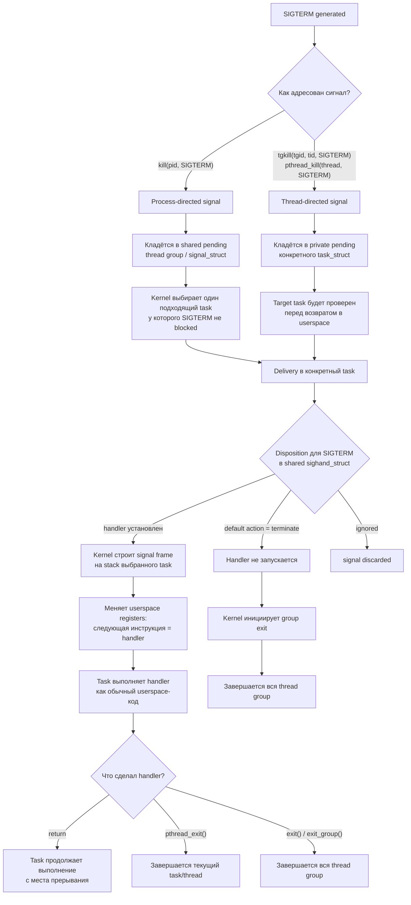

# Linux

## 1. Процесс, поток и `task_struct`

**`task_struct`** → объект ядра для одной планируемой сущности: процесса или потока.

**Процесс** → группа потоков, обычно разделяющих память, FD, cwd/root и обработчики сигналов.

**Поток** → отдельный `task_struct`, который выполняется планировщиком, но может разделять ресурсы с другими потоками процесса.

**TID** → ID конкретного потока.

**TGID** → ID группы потоков, то есть привычный PID процесса.

**Лидер группы потоков / главный поток процесса** → поток, у которого `TID == TGID`.

**Остальные потоки** → `TID != TGID`, но `TGID` общий.

**PID в userspace** → обычно TGID, если говорят о процессе; в ядре PID namespace хранит ID разных типов.

**`getpid()`** → возвращает TGID.

**`gettid()`** → возвращает TID текущего потока.

**`/proc/<PID>/task/`** → список TID всех потоков процесса.


## 2. Какие ресурсы может разделять `task_struct`

У каждого потока есть ссылки на отдельные объекты ядра:

**`mm_struct`** → виртуальное адресное пространство процесса.

**`files_struct`** → таблица файловых дескрипторов.

**`fs_struct`** → cwd, root и umask.

**`sighand_struct`** → таблица обработчиков сигналов.

**`signal_struct`** → общее signal-состояние thread group: process-directed pending signals, group stop/exit, timers/accounting.

**credentials** → UID, GID, groups, capabilities.

**namespaces** → какие PID, mounts, network, users и другие объекты видит задача.

Главная модель:

```text
task_struct
├─ mm
├─ files
├─ fs
├─ sighand/signal
├─ credentials
└─ namespaces
```


## 3. `clone()`, `fork()`, потоки и уровни клонирования

**`clone()` / `clone3()`** → низкоуровневое создание новой `task_struct` с выбором, какие ресурсы разделять.

Основные флаги:

**`CLONE_VM`** → разделять `mm_struct`, то есть одно адресное пространство.

**`CLONE_FILES`** → разделять одну таблицу FD.

**`CLONE_FS`** → разделять cwd/root/umask.

**`CLONE_SIGHAND`** → разделять обработчики сигналов.

**`CLONE_THREAD`** → поместить задачу в ту же thread group, общий TGID.

**`CLONE_NEWNS`** → создать новый mount namespace.

**`CLONE_NEWPID`** → создать новый PID namespace.

**`CLONE_NEWNET`** → создать новый network namespace.

**`CLONE_NEWUSER`** → создать новый user namespace.

**`CLONE_NEWUTS`** → отдельные hostname/domainname.

**`CLONE_NEWIPC`** → отдельный SysV IPC / POSIX message queue namespace.

Упрощённо:

```text
много CLONE_* для разделения ресурсов
→ поток

почти ничего не разделяем
→ отдельный процесс
```

**`fork()`** → специальный случай создания нового процесса: новый PID/TGID, отдельные kernel-объекты, но память сначала Copy-on-Write.

**`pthread_create()`** → обычно вызывает `clone()` с `CLONE_VM | CLONE_FILES | CLONE_FS | CLONE_SIGHAND | CLONE_THREAD ...`.


## 4. Что происходит с памятью при `fork()`

До `fork()`:

```text
parent task_struct
→ parent mm_struct
→ page tables
→ физические страницы
```

После `fork()`:

```text
parent task_struct → parent mm_struct ─┐
                                       ├→ те же физические страницы
child task_struct  → child mm_struct  ─┘
```

Но:

- у родителя и ребёнка **разные `mm_struct`**;
- у них **разные page tables**;
- PTE (Page Table Entry, запись в таблице страниц) на приватные страницы помечаются как read-only/COW;
- физические страницы временно общие;
- при первой записи возникает page fault;
- ядро выделяет новую физическую страницу;
- копирует содержимое;
- меняет PTE (Page Table Entry, запись в таблице страниц) пишущего процесса.

**Copy-on-Write** → копирование происходит не во время `fork()`, а при первой записи в общую приватную страницу.

**Файловые `MAP_SHARED` mappings** → остаются разделяемыми.

**`MAP_PRIVATE` mappings** → используют COW.


## 5. `execve()`

**`execve()`** → заменяет программу внутри существующего процесса.

Сохраняется:

- PID/TGID;
- credentials с учётом setuid/setgid/capabilities;
- FD без `FD_CLOEXEC`;
- некоторые свойства процесса.

Заменяется:

- `mm_struct`;
- код;
- heap;
- stack;
- mappings;
- argv/env;
- обработчики пойманных сигналов сбрасываются на default.

Главная формула:

```text
fork() → новый процесс
execve() → новая программа в старом PID
```


## 6. Родители, дети, zombie и orphan

**Parent PID** → PID процесса, который создал ребёнка.

**Zombie** → ребёнок завершился, но родитель ещё не забрал exit status через `wait()` / `waitpid()`.

**Zombie хранит** → PID, exit code, usage statistics; память программы уже освобождена.

**Orphan** → живой ребёнок, чей родитель умер.

**Reparenting** → orphan принимает PID 1 или subreaper.

**`waitpid(..., WNOHANG)`** → проверить ребёнка без блокировки.


## 7. Сигналы

**Сигнал** → асинхронное уведомление thread group целиком или конкретному потоку.

**Disposition** → default action, ignore или handler.

**Blocked signal** → остаётся pending до разблокировки.

**Process-directed signal** → адресован thread group целиком; handler выполняется в одном подходящем потоке.

**Thread-directed signal** → адресован конкретному TID через `tgkill()`/`pthread_kill()` или hardware exception.

**Terminate/stop/continue disposition** → даже для thread-directed signal действие применяется ко всей thread group.

Основные:

**`SIGTERM`** → просьба корректно завершиться.

**`SIGKILL`** → принудительное завершение; сигнал нельзя поймать, заблокировать или игнорировать, но task может завершиться не мгновенно, например пока находится в uninterruptible sleep (D-state).

**`SIGSTOP`** → остановка; нельзя поймать или игнорировать.

**`SIGCONT`** → продолжить остановленный процесс.

**`SIGCHLD`** → изменилось состояние ребёнка.

**`SIGSEGV`** → неверный виртуальный адрес или запрещённый доступ.

**`SIGBUS`** → адресная операция невозможна из-за backing/alignment/device mapping.

**`SIGINT`** → обычно Ctrl+C.

**`SIGHUP`** → исторически потеря терминала; часто используется как reload.

**Realtime signals** → `SIGRTMIN..SIGRTMAX`, очередятся и могут нести значение.

### Linux signal handling: пример `SIGTERM`

Сигнал в Linux лучше представлять не как «мгновенный прыжок в handler», а как событие,
которое сначала становится pending, а потом доставляется конкретному `task_struct`
перед возвратом этого task в userspace.



## Короткая модель

```text
pending signal:
  - group-level: shared pending в signal_struct
  - task-level: private pending в конкретном task_struct

handler/disposition:
  - общий для thread group через sighand_struct

handler execution:
  - всегда в одном конкретном task
  - на stack этого task

default terminate/stop/continue/core:
  - действует на всю thread group
```

## Примеры

```text
kill(pid, SIGTERM), handler есть
→ signal pending на thread group
→ kernel выбирает один task
→ handler выполняется в этом task

kill(pid, SIGTERM), handler нет
→ default terminate
→ завершается вся thread group

pthread_kill(thread, SIGTERM), handler есть
→ signal pending на конкретный task
→ handler выполняется в этом task

pthread_kill(thread, SIGTERM), handler нет
→ default terminate
→ завершается вся thread group
```

Главная формула:

```text
pending бывает group-level или task-level;
handler/disposition общий для thread group;
handler выполняется в одном task;
fatal/job-control default action действует на всю thread group.
```


## 8. Состояния задач

**`R`** → running или runnable.

**`S`** → interruptible sleep; ждёт событие, может быть разбужен сигналом.

**`D`** → uninterruptible sleep; ждёт завершения kernel operation, часто I/O.

**`T`** → stopped или traced.

**`Z`** → zombie.

**`I`** → idle kernel thread.

Важно:

```text
R = уже работает на CPU или ждёт CPU
D = ждёт внутри ядра и не реагирует немедленно даже на SIGKILL
```


## 9. Блокирующий I/O, wait queue и `epoll`

**Blocking `read()`** → если данных нет, поток засыпает в wait queue.

**Wait queue** → список задач, ожидающих конкретное событие ядра.

**Wakeup** → драйвер или подсистема меняет состояние задачи на runnable.

**`epoll`** → ядровый объект, который отслеживает readiness множества FD.

**`epoll_wait()`** → один поток спит до готовности одного или нескольких FD.

**Readiness** → операция, вероятно, не заблокируется сейчас.

**Сигнал ≠ readiness** → разные механизмы.

Типовые места, где task может ждать:

| Механизм | Что ждёт task | State                 | Критерий wakeup |
|---|---|-----------------------|---|
| Run queue | CPU time | `R`                   | scheduler выбрал task для выполнения |
| Generic wait queue | событие ядра | `S` или `D`           | владелец события вызвал wakeup |
| Socket/file wait queue | данные, место в buffer, readiness | `S`                   | FD стал readable/writable/error-ready |
| `epoll` wait queue | readiness одного из tracked FD | `S`                   | хотя бы один FD стал ready или истёк timeout |
| Futex wait queue | userspace lock/condvar | `S`                   | `futex_wake()`, timeout или signal |
| Timer/hrtimer queue | время | `S`                   | истёк timeout/sleep deadline |
| Completion wait | завершение kernel operation | `S` или `D`           | operation завершилась и сделала `complete()`/wakeup |
| Kernel mutex/rwsem wait list | kernel lock | `S` или `D`           | lock освободился |
| Block/device queue | завершение I/O request | чаще `D` для sync I/O | device/driver завершил request |
| Signal/job-control stop | продолжение после stop/tracing | `T`                   | `SIGCONT`, debugger или ptrace event |
| Zombie list | parent забрал exit status | `Z`                   | parent вызвал `wait()`/`waitpid()` |

Важно: не везде в очереди лежит сама task. Например в block/device queue обычно лежит I/O request, а task отдельно спит на completion/wait queue.


## 10. DMA, IRQ и устройство

**DMA** → устройство передаёт данные между собой и RAM без копирования каждого байта CPU.

**IRQ** → уведомление CPU о событии устройства.

**MSI/MSI-X** → PCIe-устройство сигнализирует прерыванием через специальную memory write transaction.

Типичный read с диска:

```text
read()
→ page cache miss
→ block request
→ task D
→ NVMe DMA в RAM
→ completion IRQ
→ driver завершает request
→ task становится R
```


## 11. CPU utilization

**CPU utilization** → доля времени за интервал, когда CPU не был idle.

Категории:

**user** → код userspace.

**system** → код ядра.

**iowait** → CPU idle, пока есть ожидающий I/O.

**irq** → hardware interrupts.

**softirq** → отложенная обработка событий ядра.

**steal** → гипервизор забрал виртуальный CPU.

**nice** → user CPU для процессов с изменённым nice.

Цвета CPU-полоски в `htop`:

| Цвет | Что означает |
|---|---|
| Green | `user`: обычный userspace CPU |
| Blue | `nice`: userspace CPU процессов с изменённым nice |
| Red | `system`: kernel CPU |
| Yellow | `irq`: hardware interrupts |
| Magenta/Purple | `softirq`: software interrupts |
| Gray | `iowait`: CPU idle, пока есть ожидающий I/O |
| Cyan | `steal`: CPU time, забранный гипервизором |
| Orange | `guest`: CPU time виртуальных guest-задач |

Цвета могут отличаться из-за темы/настроек `htop`, но смысл сегментов остаётся тем же.

Важно:

- 100% одного процесса в `top` часто означает один логический CPU;
- 100% всей машины означает заняты почти все логические CPU;
- высокий `%sys` → много работы в ядре;
- высокий `%iowait` → подсказка про I/O, но не диагноз;
- низкий общий CPU может скрывать одно забитое ядро.


## 12. Load average

**Load average** → количественная характеристика: экспоненциально сглаженное среднее число задач, которые находятся в активном/проблемном ожидании.

Это не процент загрузки CPU и не объём потреблённых ресурсов. Load average отвечает на вопрос:

```text
сколько задач в среднем за период либо выполнялись/хотели CPU, либо висели в D-state
```

Linux считает задачи в состояниях:

```text
TASK_RUNNING + TASK_UNINTERRUPTIBLE
```

В терминах статусов:

- `R` running → task прямо сейчас выполняется на CPU;
- `R` runnable → task готова выполняться и ждёт CPU в run queue;
- `D` uninterruptible sleep → task ждёт kernel operation, часто I/O.

Не учитывает обычные `S` sleepers, `T` stopped/traced и `Z` zombies.

**1 / 5 / 15** → три EWMA: усреднение примерно за 1, 5 и 15 минут.

**Load average не процент** → `4.0` значит не «4%» и не «400% CPU», а примерно 4 задачи в учитываемых состояниях.

**Load average не нормализован по CPU** → `4.0` на 4 CPU и `4.0` на 64 CPU имеют разный практический смысл.

Интерпретация:

```text
высокий load + высокий CPU
→ вероятна CPU saturation

высокий load + низкий CPU
→ искать D-state, storage, NFS, cgroup quota, affinity
```

Примеры:

```text
4 CPU, load 4.0, CPU высокий
→ машина примерно на пределе по CPU

64 CPU, load 4.0
→ обычно небольшой load

CPU низкий, load 20.0
→ вероятно, много задач в D-state или другом ожидании ядра
```

`/proc/loadavg`:

```text
1m 5m 15m running/total latest_pid
```


## 13. Виртуальная память

**Virtual address** → адрес, которым пользуется процесс.

**MMU** → переводит virtual address в physical address.

**Page table** → `virtual page → physical page frame + flags`.

**TLB** → кеш переводов виртуальных адресов.

**VMA** → диапазон virtual addresses с общими permissions и backing/mapping properties.

**Page fault** → нужного mapping/page сейчас нет или нарушены права.

**Minor fault** → данные уже в RAM, но mapping надо настроить.

**Major fault** → пришлось читать данные с диска.


## 14. Аллокаторы памяти

**`malloc()`** → userspace allocator, не системный вызов.

**`mmap()` / `brk()`** → способы получить виртуальные диапазоны у ядра.

**Buddy allocator** → выдаёт физические страницы ядру.

**SLUB** → выделяет маленькие типизированные kernel objects.

**`kmalloc()`** → маленькие физически непрерывные kernel allocations, обычно через SLUB.

**`vmalloc()`** → виртуально непрерывная, физически разбросанная память ядра.

**First touch** → физическая страница часто выделяется при первом обращении, а не при `malloc()`.


## 15. RAM: основные категории

**Anonymous memory** → heap, stack, anonymous mmap, private COW pages.

**File-backed memory** → executable, `.so`, mmap-файлы.

**Kernel memory** → структуры задач, page tables, network buffers, slab и другое.

**Page cache** → содержимое файлов, закешированное в RAM.

**Free** → буквально неиспользуемые страницы.

**Available** → оценка, сколько памяти можно выдать без тяжёлого swap.

Метрики памяти процесса:

**VIRT / VSZ (Virtual Memory Size / Virtual Set Size)** → весь виртуальный адресный диапазон процесса: reserved/lazy mappings, file mappings, mapped shared libs, heap/stack ranges; может сильно превышать RAM и не означает реально занятую физическую память.

**RSS (Resident Set Size)** → сколько физических страниц сейчас отображено в процесс; shared pages считаются целиком каждому процессу.

**PSS (Proportional Set Size)** → accounting-метрика: RSS с «коллективной ответственностью» за shared pages. Private pages считаются целиком, shared pages делятся между процессами, которые их используют; не равно памяти, которая гарантированно освободится при kill.

**USS (Unique Set Size) / Private memory** → память, уникальная для процесса: private pages, которые не разделяются с другими; ближе всего к нижней оценке RAM, которая освободится при kill.

**Shared memory** → resident pages, отображённые более чем в один процесс: `.so`, file-backed mappings, `MAP_SHARED`, tmpfs/shmem, COW pages до первой записи.

**Private Clean** → private file-backed pages без изменений; можно выбросить и перечитать с backing file.

**Private Dirty** → private изменённые pages; обычно anonymous heap/stack/COW, реальная частная нагрузка на RAM/swap.

**Shared Clean** → shared pages без изменений; часто код `.so`/executables и clean page cache.

**Shared Dirty** → shared изменённые pages; например writable `MAP_SHARED`/shmem/tmpfs.

**Anonymous RSS (Anonymous Resident Set Size)** → resident anonymous memory: heap, stack, anonymous mmap, COW private pages.

**Swap** → сколько страниц процесса выгружено в swap.

**SwapPss (Swap Proportional Set Size)** → доля swap с пропорциональным учётом shared swapped pages.

В `smaps`/`smaps_rollup` PSS/USS полезнее RSS для оценки вклада процесса, но для OOM и reclaim важны также `oom_score_adj`, cgroup, dirty/clean, anonymous/file-backed и shared refs.


## 16. Page cache

**Page cache** → общий кеш содержимого файлов в RAM.

**Clean page** → совпадает с диском, можно выбросить.

**Dirty page** → изменена, перед reclaim надо записать.

Read:

```text
read()
→ page cache hit → RAM
→ miss → disk → page cache → process
```

Write:

```text
write()
→ page cache page становится dirty
→ writeback позже пишет на диск
```

**Executable и `.so`** → их file-backed страницы тоже проходят через page cache.

**`MAP_SHARED`** → изменения видны другим mapping и уходят в файл.

**`MAP_PRIVATE`** → первая запись создаёт anonymous COW page.


## 17. Shared libraries

**`.so`** → ELF shared object.

**Dynamic linker** → мапит зависимости, делает relocations, запускает constructors.

**`DT_NEEDED`** → список runtime-зависимостей ELF.

**Code и read-only data `.so`** → обычно физически разделяются между процессами.

**Writable globals `.so`** → отдельное состояние на процесс через private mappings/COW.

**Static binary** → код библиотек уже внутри executable; обычные `.so` могут не требоваться.


## 18. Swap

**Swap** → disk-backed место для вытесненных anonymous/private pages.

В swap не надо отправлять чистый page cache: его можно просто выбросить и перечитать из файла.

**Swap-out** → RAM page записана в swap.

**Swap-in** → page fault возвращает страницу в RAM.

**`swappiness`** → насколько охотно ядро выгружает приватную память процессов в swap вместо того, чтобы освобождать файловый кеш; это не процент заполнения RAM.

Где смотреть текущее значение:

```bash
cat /proc/sys/vm/swappiness
sysctl vm.swappiness
```

Где хранится runtime-настройка:

```text
/proc/sys/vm/swappiness
```

Изменить до reboot:

```bash
sudo sysctl -w vm.swappiness=10
```

Задать persistently:

```text
/etc/sysctl.conf
/etc/sysctl.d/*.conf
```

Например:

```text
vm.swappiness = 10
```

Диапазон:

```text
0..200
```

В старых материалах часто встречается модель `0..100`, поэтому это легко перепутать. В актуальной kernel documentation для `vm.swappiness` верхняя граница — `200`; значения выше `100` имеют смысл, когда swap I/O дешевле/быстрее, чем filesystem I/O, например zram/zswap или быстрый swap backend.

Типичный default во многих дистрибутивах:

```text
60
```

Смысл значения:

```text
меньше swappiness
→ ядро сильнее старается сохранить anonymous/private memory в RAM
→ чаще освобождает file-backed page cache

больше swappiness
→ ядро охотнее вытесняет anonymous/private memory в swap
→ может дольше держать file-backed cache в RAM
```

`swappiness = 0`:

```text
не отключает swap полностью
```

Это минимальная агрессивность swap-out. Ядро будет максимально избегать вытеснения anonymous/private pages в swap, пока это возможно, и предпочитать reclaim файлового кеша. Но при серьёзном memory pressure swap всё равно может использоваться.

Максимальное значение:

```text
swappiness = 200
```

Это максимальная агрессивность swap-out: ядро сильно склоняется к вытеснению anonymous/private pages в swap вместо освобождения file-backed cache. Такое может иметь смысл, если swap backend относительно быстрый или file-backed I/O дороже, но на обычном медленном disk swap может привести к заметным latency и thrashing.

Практическая граница:

```text
swappiness
→ меняет баланс reclaim между anonymous/private memory и file-backed cache

swappiness
→ не задаёт лимит RAM
→ не задаёт процент, после которого включается swap
→ не гарантирует отсутствие swap при 0
```

Плохо не само `SwapUsed`, а:

- постоянные `si/so`;
- major faults;
- disk latency;
- thrashing.

**Swap** → аварийный запас времени, а не замена RAM.


## 19. OOM killer

**OOM** → ядро не смогло удовлетворить allocation после reclaim/writeback/swap.

**Global OOM** → закончилась память хоста.

**Cgroup OOM** → процесс вышел за memory limit своего cgroup.

**`oom_score`** → текущая привлекательность процесса как жертвы.

**`oom_score_adj`** → ручная поправка от `-1000` до `1000`.

**`-1000`** → не выбирать обычным OOM killer; не гарантирует работоспособность системы.

OOM killer не знает бизнес-ценность процесса. Он выбирает жертву, освобождение которой поможет системе выжить.

Надёжность задаётся заранее:

- cgroups;
- `MemoryMax`;
- отдельные сервисы/узлы;
- разумный `oom_score_adj`;
- memory limits.


## 20. Файловая система

**Filesystem** → структура, которая превращает блоки устройства в файлы, каталоги и metadata.

Основные объекты:

**superblock** → metadata всей filesystem.

**inode** → metadata одного файлового объекта.

**directory entry** → запись `имя → inode number`.

**data blocks / extents** → содержимое обычного файла.

Главная цепочка:

```text
path
→ directory entries
→ inode
→ data blocks / callbacks / driver
```


## 21. Inode

**Inode** → безымянный объект filesystem: обычный файл, каталог, symlink, socket, FIFO или device node.

Обычно хранит:

- тип;
- permissions;
- UID/GID;
- size;
- timestamps;
- link count;
- block/extents references;
- filesystem-specific metadata.

Не хранит имя файла.

Один inode может иметь несколько имён через hard links.

**Link count** → число directory entries, указывающих на inode.

Файл окончательно освобождается, когда:

```text
link count == 0
и
нет открытых ссылок ядра
```


## 22. Directory и directory entry

**Directory** → inode специального типа: filesystem хранит в нём directory entries:

```text
name → inode number
```

Userspace читает directory entries через `readdir()`/`getdents64()`, а не обычным `read()`.

Сырой формат directory data — деталь конкретной filesystem; VFS отдаёт стабильную абстракцию записей каталога.

Каталог не хранит полный путь. Он хранит только имена непосредственных детей.

Полный путь:

```text
/etc/nginx/nginx.conf
```

разбирается как:

```text
/
→ etc
→ nginx
→ nginx.conf
```


## 23. Dentry

**`struct dentry`** → VFS-объект для результата lookup компонента пути: связка `parent directory + name → inode` или negative result.

Содержит логически:

```text
name
parent dentry
inode pointer
flags
reference counters
cache state
```

**Dentry cache / dcache** → кеш уже разобранных компонентов путей.

**Negative dentry** → кешированное знание, что такого имени в каталоге нет.

Разница:

```text
directory entry → запись filesystem
dentry          → объект VFS в RAM
```


## 24. Hard link

**Hard link** → ещё одна directory entry на тот же inode.

```bash
ln file.txt another.txt
```

```text
file.txt    ─┐
             ├→ один inode
another.txt ─┘
```

Нет оригинала и копии. Оба имени равноправны.

Ограничения:

- обычно только внутри одной filesystem;
- hard links на директории пользователю запрещены;
- удаление одного имени не удаляет inode, пока есть другие ссылки.


## 25. Symbolic link

**Symlink** → отдельный inode типа symlink, содержащий строку пути.

```bash
ln -s /opt/app/config.yaml current
```

```text
current inode
→ data: "/opt/app/config.yaml"
```

Если цель удалили, symlink становится broken.

Symlink:

- может пересекать filesystem;
- может ссылаться на каталог;
- может быть относительным или абсолютным;
- относительный путь считается от каталога самого symlink.


## 26. Mount

**Mount** → прикрепить корень одной filesystem к каталогу в существующем дереве.

```text
source filesystem
→ mount point
→ единое дерево /
```

**Mount point** → каталог, где происходит переключение на другую filesystem.

Файлы, уже лежавшие в mount point, не удаляются — они скрыты до `umount`.

**`/etc/fstab`** → постоянные mounts при загрузке.

**UUID** → стабильнее, чем `/dev/sdb1`.

Полезно:

```bash
findmnt
findmnt -T /path
lsblk -f
blkid
```


## 27. Bind mount

**Bind mount** → показать существующий каталог ещё в одном месте дерева.

```bash
mount --bind /srv/data /var/lib/app
```

Это не symlink: VFS видит настоящий mount.

Используется в:

- контейнерах;
- chroot;
- изоляции;
- подстановке каталогов.


## 28. FD, `struct file`, dentry и inode

**FD (File Descriptor)** → неотрицательный `int`-handle в userspace, индекс в per-process FD table; не pointer и не `int64` на 64-bit системах.

Обычно:

```text
0 stdin
1 stdout
2 stderr
3+ остальные объекты
```

Полная цепочка:

```text
fd
→ files_struct
→ struct file
→ struct path
   ├─ mount
   └─ dentry
→ inode
→ data / filesystem callbacks / driver
```

**`struct file`** → конкретное открытие объекта.

Хранит:

- current offset;
- open flags;
- access mode;
- file operations;
- path;
- reference count.

**Inode** → сам объект.

**Dentry** → его имя в конкретном каталоге.

Максимальный FD ограничен `RLIMIT_NOFILE` (`ulimit -n`) и kernel limits, а не размером машинного слова.


## 29. `open()`, `dup()` и `fork()` для FD

Два `open()` одного файла:

```text
fd 3 → struct file A, offset A ─┐
                                ├→ один inode
fd 4 → struct file B, offset B ─┘
```

`dup()`:

```text
fd 3 ─┐
      ├→ один struct file → общий offset
fd 4 ─┘
```

`fork()`:

```text
parent fd 3 ─┐
             ├→ один struct file
child fd 3  ─┘
```

`execve()` → FD сохраняются, кроме `FD_CLOEXEC`.


## 30. Deleted-but-open file

`rm` удаляет directory entry, а не обязательно inode.

Если файл открыт:

```text
rm path
→ имя исчезло
→ open struct file держит inode
→ процесс продолжает читать/писать
```

Доступ:

```text
/proc/<PID>/fd/<FD>
```

Поиск:

```bash
lsof +L1
lsof | grep deleted
```

Восстановление копией:

```bash
cp /proc/<PID>/fd/<FD> recovered.log
```

После закрытия последнего FD при link count `0` inode и blocks освобождаются.

Классический симптом:

```text
df → диск занят
du → больших файлов нет
```


## 31. VFS

**VFS** → единый интерфейс ядра ко всем filesystem и файловым объектам.

Общий путь:

```text
pathname
→ dentry
→ inode
→ operations
```

Основные таблицы поведения:

**`inode_operations`** → lookup, create, mkdir, unlink, rename, symlink.

**`file_operations`** → read, write, mmap, poll, ioctl, release.

Это полиморфизм на C:

```text
VFS вызывает read
→ конкретная filesystem / driver подставляет свою реализацию
```


## 32. `/proc`

**procfs** → виртуальная filesystem, которая показывает состояние процессов и ядра.

```text
/proc/<PID>/status
/proc/<PID>/maps
/proc/<PID>/fd
/proc/<PID>/fdinfo
/proc/<PID>/environ
/proc/<PID>/limits
/proc/<PID>/ns
/proc/<PID>/mountinfo
```

Общесистемное:

```text
/proc/meminfo
/proc/stat
/proc/loadavg
/proc/uptime
/proc/mounts
```

Inode procfs не указывает на disk blocks. Его `read()` вызывает callback, который генерирует данные из структур ядра.


## 33. `/sys`

**sysfs** → структурированное представление kernel objects, devices, buses и drivers.

Примеры:

```text
/sys/class/net/
/sys/block/
/sys/devices/
```

Файл sysfs обычно представляет один атрибут.

```text
read()
→ callback show()
write()
→ callback store()
```

Запись в sysfs часто означает изменение настройки ядра или драйвера.


## 34. `/dev`

**devtmpfs** → filesystem с device nodes.

**Device node** → inode типа character или block device.

Хранит:

```text
major:minor
```

**major** → какой драйвер.

**minor** → какой экземпляр устройства.

Примеры:

```text
/dev/null       char device
/dev/tty        char device
/dev/nvme0n1    block device
```

Цепочка:

```text
open("/dev/null")
→ inode device node
→ major/minor
→ driver file_operations
```


## 35. «В Linux всё файл»

Точнее:

> Не всё является файлом, но многое представлено через VFS-интерфейс и FD.

Не файловые kernel objects:

- `task_struct`;
- sockets;
- pipes;
- eventfd;
- epoll;
- timerfd;
- signalfd.

Но процесс часто получает к ним FD и работает через:

```text
read
write
poll
ioctl
close
```


## 36. `eventfd`

**`eventfd()`** → создаёт anonymous kernel object с 64-битным счётчиком.

`write()` → увеличивает счётчик.

`read()` → читает и обнуляет счётчик или уменьшает на 1 с `EFD_SEMAPHORE`.

Новый вызов `eventfd()` создаёт новый объект.

Один eventfd между процессами получают через:

- наследование после `fork()`;
- передачу FD через Unix socket `SCM_RIGHTS`.

`/proc/<PID>/fdinfo/<FD>` → показывает type-specific состояние eventfd.


## 37. Socket и порт

**Socket object** → kernel object сетевого endpoint.

**Port** → часть сетевого адреса `IP:port`.

**Listening socket** → принимает новые соединения.

**Accepted socket** → отдельный FD для одного соединения.

```text
fd 3 → listening :5432
fd 4 → client A
fd 5 → client B
```


## 38. Unix domain socket

**Unix socket** → IPC-сокет между процессами на одной машине.

Pathname socket:

```text
/run/app.sock
```

После `bind()` появляется inode типа socket.

Файл сокета:

- не хранит сообщения;
- служит именем точки подключения;
- права на path участвуют в доступе;
- можно удалить, и существующие соединения продолжат работать;
- новые подключения по удалённому пути не пройдут.

**Abstract Unix socket** → имя живёт только в ядре, в filesystem записи нет; в `ss` часто показывается с `@`.

**`SCM_RIGHTS`** → передача FD через Unix socket.


## 39. FUSE

**FUSE** → filesystem callbacks реализуются userspace-процессом.

```text
open/read/write
→ VFS
→ FUSE kernel module
→ userspace filesystem daemon
```

Можно создать виртуальные файлы, чьё содержимое:

- генерируется;
- приходит из API;
- строится из базы;
- вообще не хранится на диске.

FUSE действует только внутри своего mount point.


## 40. Файловые трюки

**Atomic rename** → внутри одной filesystem `rename()` обычно переключает имя атомарно.

Надёжная запись:

```text
write temp
→ fsync(temp)
→ rename(temp, final)
→ fsync(parent directory)
```

**Cross-filesystem `mv`** → copy + delete, не atomic rename.

**Sparse file** → логический размер больше реально занятых blocks.

**Reflink** → два inode сначала разделяют data extents через COW.

Часто поддерживается:

- Btrfs;
- XFS с reflink.

Обычно не поддерживается обычным ext4.


## 41. Основные filesystem

**ext4** → зрелый универсальный default для обычного Linux-сервера.

**XFS** → большие volumes, масштабный параллельный I/O; shrink обычно недоступен.

**Btrfs** → COW, snapshots, subvolumes, compression, checksums, reflink, send/receive.

**ZFS** → filesystem + volume manager + pools + checksums + RAIDZ + snapshots + replication.

**tmpfs** → данные в RAM/swap, исчезают после reboot.

**NFS** → общий каталог по сети.

**CephFS** → распределённая filesystem поверх Ceph.

**exFAT** → переносные носители между ОС, не серверная Unix filesystem.


## 42. systemd

**systemd** → PID 1 и менеджер units/services хоста.

`[Service]`:

```ini
User=myapp
ExecStart=/usr/local/bin/myapp
Restart=on-failure
```

Типы:

**`Type=simple`** → systemd считает service started сразу после запуска процесса; готовности приложения не ждёт.

**`Type=exec`** → systemd считает запуск успешным после успешного `execve()`.

**`Type=notify`** → приложение явно сообщает `READY=1`.

**`Type=oneshot`** → короткая команда должна завершиться.

**`Type=forking`** → старый daemon fork-модели.

Зависимости:

**`Wants=`** → мягко добавить unit в transaction.

**`Requires=`** → сильная requirement dependency: dependency включается в transaction, и её failure/deactivation может повлиять на requiring unit.

Порядок:

**`After=` / `Before=`** → только ordering.

Важно:

```text
Requires != After
After не запускает unit
```

Команды:

```bash
systemctl start
systemctl stop
systemctl restart
systemctl enable
systemctl disable
systemctl mask
systemctl daemon-reload
systemctl status
systemctl cat
systemctl show
```


## 43. D-Bus

**D-Bus** → userspace message bus для IPC между процессами.

Обычно есть два bus:

**System bus** → системные сервисы: systemd, NetworkManager, login/session management.

**Session bus** → процессы внутри пользовательской сессии.

Транспорт обычно Unix socket.

Модель:

```text
client
→ bus daemon / broker
→ service
```

Основные сущности:

**Bus name** → имя сервиса на bus, например `org.freedesktop.systemd1`.

**Object path** → путь объекта внутри сервиса, например `/org/freedesktop/systemd1`.

**Interface** → набор methods/properties/signals.

**Method call** → запрос к сервису.

**Signal** → broadcast/event от сервиса подписчикам.

`systemctl` общается с systemd в основном через D-Bus API.


## 44. journald

**journald** → сборщик structured logs systemd.

Источники:

- stdout/stderr service;
- kernel;
- systemd;
- syslog API;
- metadata процесса.

Полезно:

```bash
journalctl -u myapp
journalctl -u myapp -f
journalctl -u myapp -b
journalctl -b -1
journalctl --since "30 minutes ago"
journalctl -p err
journalctl -r -n 20
journalctl -k
```


## 45. `dmesg`

**`dmesg`** → просмотр kernel ring buffer: сообщений, которые пишет ядро.

Типичные события:

- boot logs;
- driver/device messages;
- OOM killer;
- filesystem/kernel warnings;
- USB/PCI/network/storage events;
- kernel oops/panic traces.

Полезно:

```bash
dmesg -T
dmesg -w
dmesg | grep -i oom
journalctl -k
```

Разница:

```text
dmesg
→ читает kernel ring buffer
→ только kernel messages
→ buffer ограничен и старые записи вытесняются

journald / journalctl
→ системный лог-агрегатор systemd
→ собирает kernel logs, stdout/stderr сервисов, syslog и metadata
→ может хранить историю по boot-ам
```

**`journalctl -k`** → kernel logs, сохранённые journald; пересекается с `dmesg`, но идёт через journal.


## 46. Environment variables

**Environment** → массив строк `KEY=VALUE`, переданный в `execve()`.

Shell:

```bash
FOO=bar
export FOO=bar
FOO=bar command
```

Ребёнок получает копию environment.

Изменение environment ребёнка не меняет environment родителя.

Запущенный процесс сам не увидит изменение конфигурационного env-файла: нужен restart или собственный reload.

systemd:

```ini
Environment=FOO=bar
EnvironmentFile=/etc/myapp/env
```


## 47. Secrets

Secret в env после старта становится обычной частью environment процесса.

Риски:

- наследование детьми;
- `/proc`;
- debug dumps;
- crash reports;
- logs;
- tooling.

Предпочтительно:

- root-owned file;
- systemd credentials;
- Vault/KMS/secret manager;
- mounted Kubernetes Secret;
- workload identity.

Задача не сделать secret магически невидимым приложению, а уменьшить доступ, lifetime и blast radius.


## 48. UID, GID и permissions

**UID** → пользователь.

**GID** → основная группа.

**Supplementary groups** → дополнительные группы.

Проверка обычных mode bits:

```text
если EUID == owner
→ owner bits

иначе если группа совпала
→ group bits

иначе
→ others bits
```

Категории не складываются.

Права записываются тремя группами:

```text
owner group others
  r w x  r w x  r w x
```

Числовая форма:

```text
r = 4
w = 2
x = 1

--- = 0
--x = 1
-w- = 2
-wx = 3
r-- = 4
r-x = 5
rw- = 6
rwx = 7
```

Примеры:

```text
755 = owner rwx, group r-x, others r-x
644 = owner rw-, group r--, others r--
600 = owner rw-, group ---, others ---
070 = owner ---, group rwx, others ---
```

Если owner bits дают меньше прав, чем group bits, owner всё равно получит owner bits: проверка останавливается на первом совпавшем классе.

Для файла:

```text
r read
w modify
x execute
```

Для каталога:

```text
r list names
w create/delete/rename entries
x traverse
```

Удаление файла определяется в первую очередь правами родительского каталога.


## 49. setuid, setgid, sticky

**setuid executable** → effective UID становится UID владельца файла при `execve()`; в `ls -l` выглядит как `s` на месте owner execute: `rws`. Если owner execute нет — `S`: `rwS`.

**setgid executable** → effective GID становится GID файла; в `ls -l` выглядит как `s` на месте group execute: `r-s`. Если group execute нет — `S`: `r-S`.

**setgid directory** → новые объекты наследуют группу каталога; в `ls -l` выглядит как `s` на месте group execute у каталога: `rws`. Если group execute нет — `S`: `rwS`.

**sticky directory** → в общей writable-директории нельзя удалять чужие файлы; в `ls -l` выглядит как `t` на месте others execute: `rwt`. Если others execute нет — `T`: `rwT`.

```bash
chmod 4755 file
chmod 2755 dir
chmod 1777 dir
```

Как это выглядит в `ls -l`:

```text
-rwsr-xr-x  root root  /usr/bin/passwd
```

`s` на месте owner execute означает `setuid` + executable.

```text
-rwxr-sr-x  root staff  ./tool
```

`s` на месте group execute означает `setgid` + executable.

```text
drwxrwsr-x  root dev  ./shared-project
```

`s` на месте group execute у каталога означает `setgid directory`: новые файлы наследуют группу каталога.

```text
drwxrwxrwt  root root  /tmp
```

`t` на месте others execute означает sticky directory.

Если execute-бит не выставлен, буква становится заглавной:

```text
-rwSr--r--  setuid есть, owner execute нет
-rw-r-Sr--  setgid есть, group execute нет
drwxrwxrwT  sticky есть, others execute нет
```


## 50. Capabilities

**Capabilities** → дробление root-привилегий.

Примеры:

```text
CAP_NET_BIND_SERVICE
CAP_CHOWN
CAP_KILL
CAP_SYS_ADMIN
```

```bash
setcap 'cap_net_bind_service=+ep' ./server
```

systemd:

```ini
AmbientCapabilities=CAP_NET_BIND_SERVICE
CapabilityBoundingSet=CAP_NET_BIND_SERVICE
```


## 51. Диагностические цепочки

Сервис не стартует:

```text
systemctl status
→ journalctl -u
→ systemctl cat/show
→ User/permissions/env
→ binary/dependencies
→ port conflict
```

Процесс занял порт:

```bash
ss -ltnp
lsof -i :PORT
```

Открытые файлы процесса:

```bash
ls -l /proc/<PID>/fd
lsof -p <PID>
```

Deleted-open:

```bash
lsof +L1
```

Какая filesystem обслуживает путь:

```bash
findmnt -T /path
```

Memory pressure:

```bash
free -h
vmstat 1
cat /proc/meminfo
```

OOM:

```bash
journalctl -k
dmesg
cat /proc/<PID>/oom_score
cat /proc/<PID>/oom_score_adj
```

D-state:

```bash
ps -eo pid,stat,wchan:32,comm
cat /proc/<PID>/stack
journalctl -k
```
