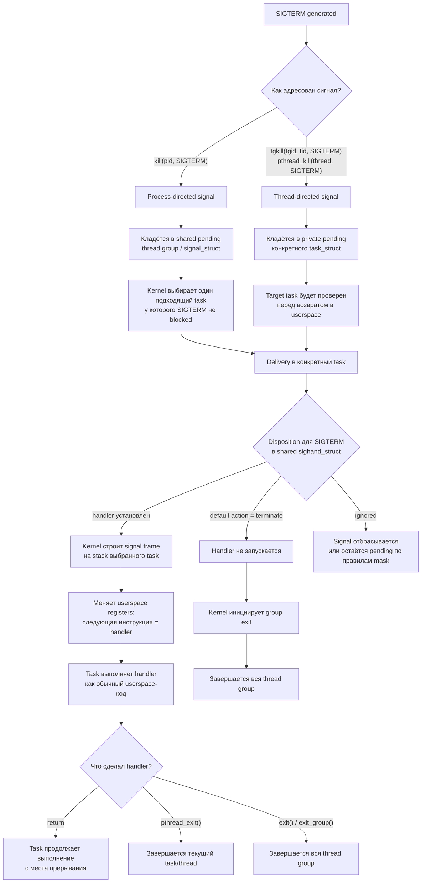

# Linux signal handling: пример `SIGTERM`

Сигнал в Linux лучше думать не как «мгновенный прыжок в handler», а как событие,
которое сначала становится pending, а потом доставляется конкретному `task_struct`
перед возвратом этого task в userspace.



## Короткая модель

```text
pending signal:
  - group-level: shared pending в signal_struct
  - task-level: private pending в конкретном task_struct

handler/disposition:
  - общий для thread group через sighand_struct

handler execution:
  - всегда в одном конкретном task
  - на stack этого task

default terminate/stop/continue/core:
  - действует на всю thread group
```

## Примеры

```text
kill(pid, SIGTERM), handler есть
→ signal pending на thread group
→ kernel выбирает один task
→ handler выполняется в этом task

kill(pid, SIGTERM), handler нет
→ default terminate
→ завершается вся thread group

pthread_kill(thread, SIGTERM), handler есть
→ signal pending на конкретный task
→ handler выполняется в этом task

pthread_kill(thread, SIGTERM), handler нет
→ default terminate
→ завершается вся thread group
```

Главная формула:

```text
pending бывает group-level или task-level;
handler/disposition общий для thread group;
handler выполняется в одном task;
fatal/job-control default action действует на всю thread group.
```
